# Network Security

## 1 - Network Security Concepts and Features introduction

### Firewall
- Safety guard of your internal business network.
- Monitors and controls incoming and outgoing network traffic based on predetermined security rules.
- Can be hardware devices(Juniper/Checkpoint) or software defined(iptables.firewalled)
- Normally deployed at the edge of you internal network.
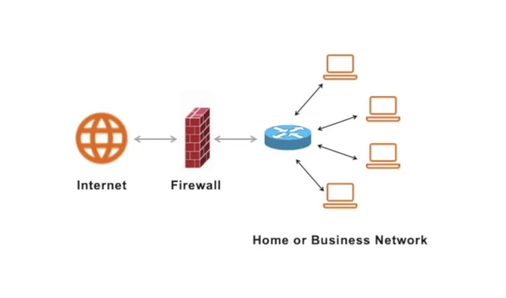

### DMZ
- DeMilitarized Zone in the network.
- Network area between trust zone and untrust zone in traditional firewall definition. 
- Normally used to deploy internet web service or internet reserve proxy for internet web service.
- For best practice, untrust zone can only visit DMZ zone and cannot access trust zone.
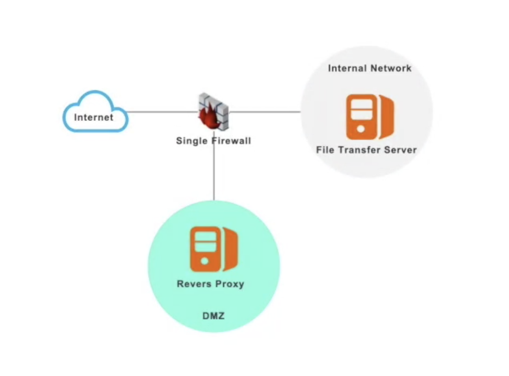

### Firewall Policy Rules
- Used to control the access between different zones.
- Normally consists of source IP, destination IP, destination port, protocol and action.
- Policy rules are sequence sensitive. Each incoming connection will match the policy from top to bottom, the first matched policy will be adopted. The rest policies on the bottom will be ignored.
- For the best practice, the last policy should be all defined in case of any unknown incoming traffic.
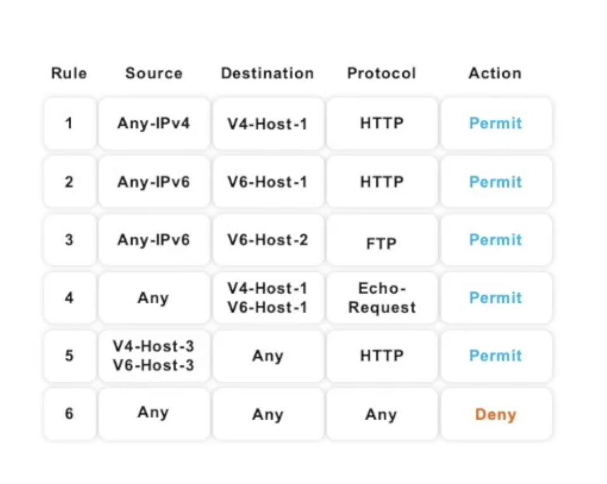

### Dos attack
- Denial-of-service attack.
- Send data flow to target machine to attempt to overload target machine and make legal visit unvailable.
- Normally only one attack machine is adopted.

### DDoS attack
- Distributed denial-of-service attack.
- The attack controller will control big amount of zombie machine to send data flood to target machine to attempt to overload target machine and make legal visit unvailable.
- Normally thousands of attackers are adopted.
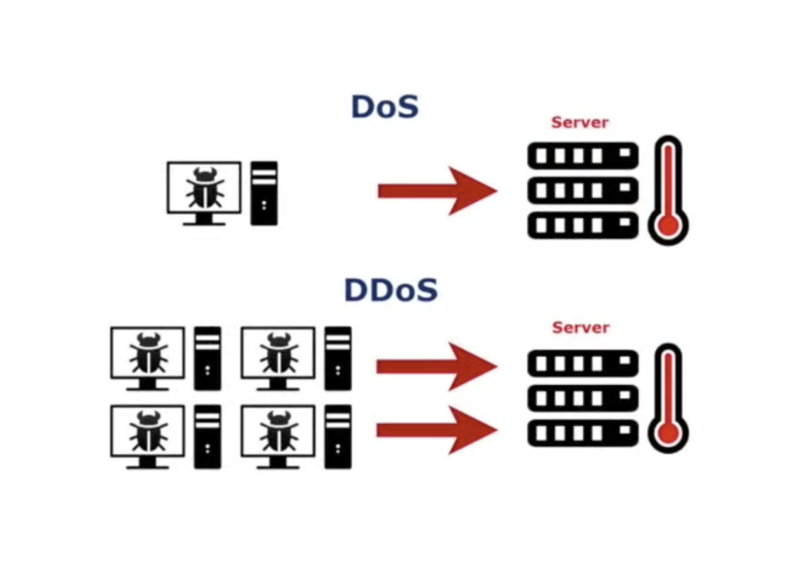

## 2 - Typical Traditional Network Security Solution

### Three layers application architecture
- Presentation layer for web service provides user interface to the end user for use.
- Business layer for backend business processing service, wihch receives requests from the web server and finshes the business processing.
- Data layer for data storage. Database are normally located at this layer.
- There will be firewall between each adjacent two layers to control access.
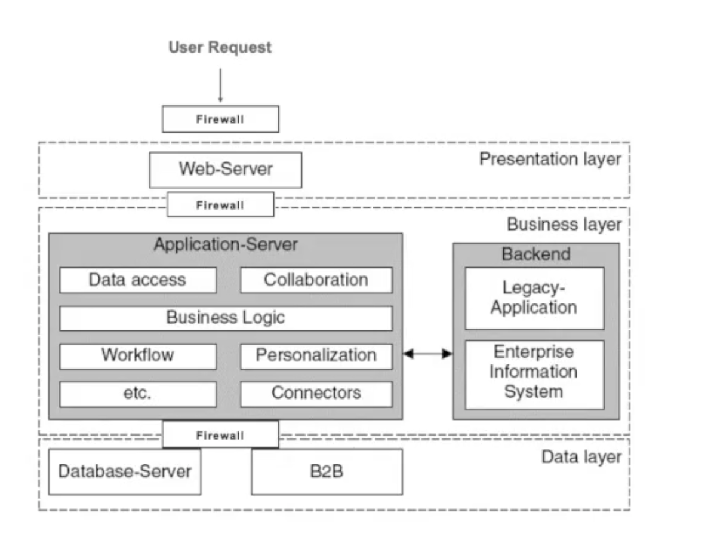

### IDS 
- Only detects system intrusion and sends alerts to the management system.
- No interference on the data flow.
- Replies on hardware support.

### IPS
- Advanced version of IDS.
- Based on IDS, it will also block the intrusion flow and protect the system being attacked.
- Replies on hardware support.
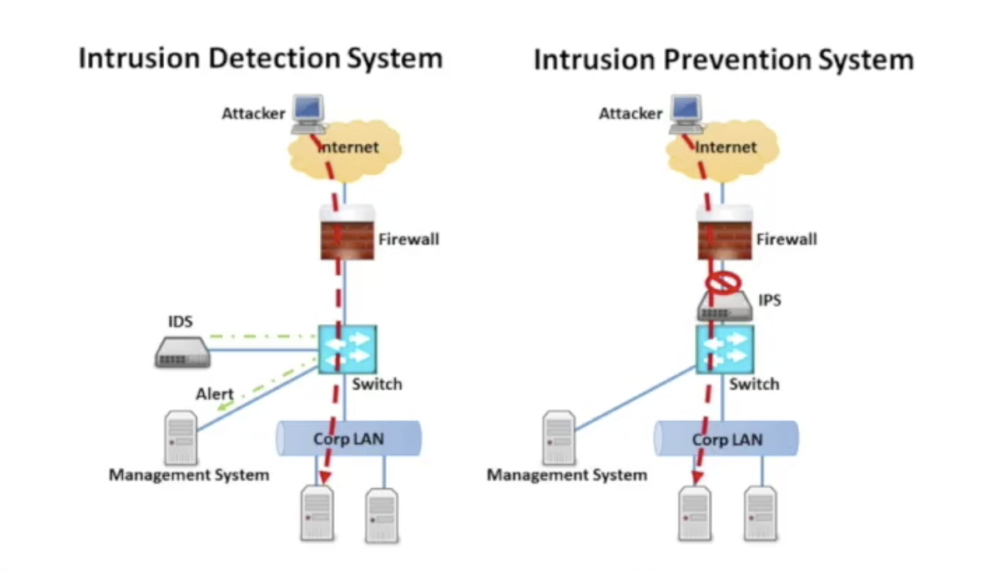

### SSL encryption
- The client and server side will keep the public and private key pair.
- Data will be encrypted before transferring with the public key on client side.
- When the data is transferring, you don't need to worry about the data being captured or stolen since the data has been encrypted.
- Data will be encrypted after arrving the destination with the private key on server side.
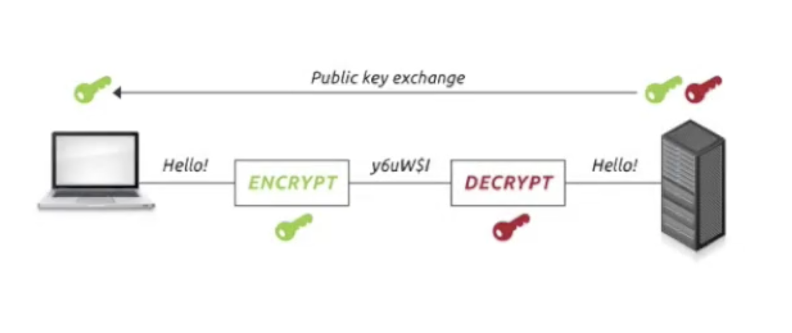

### Jump Server
- Used to access and manage the internal business system from the internet.
- Normally located inside of the system behind the firewall, like DMZ.
- Have more functions, like access auditing, role and privailege management.
- May server as independent hardware or just software deployed on server.
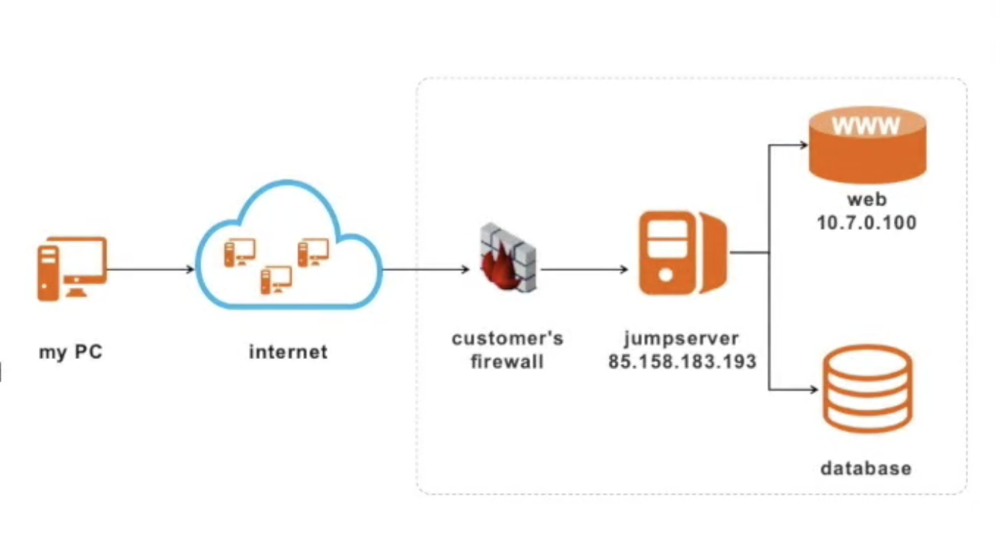

## 3 - Alibaba Cloud Network Security Solution

### Security Group
- Used to contol the access policy between cloud service instances (ECS, RDS) within one VPC.
- Act as the firewall inside of the VPC.
- Instances in one security group is just like locating in one zone in the firewall definition.
- You can configure access policies for each security group to allow special IP address to visit ports of the security group.
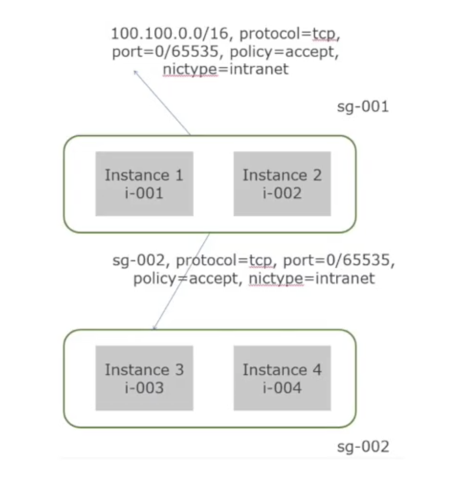

### Anti-DDoS basic version
- Anti-DDoS basic protection can protect cloud system from DDoS attack under 5Gbps.
- Multiple attack type prevention supported: ICMP Flood, UDP Flood, TCP Flood, SYNC Flood, ACK Flood.
- The DDos System is located in in the same data center with the Alibaba Cloud.
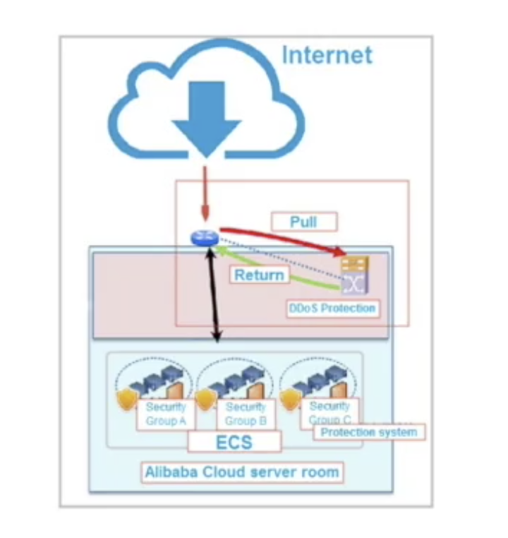

### Anti-DDoS pro version
- Anti-DDoS basic protection can protect cloud system from DDoS attack up to 20 - 300 Gbps.
- More attack types prevention supported than basic version.
- The DDos System is located in a dedicated data center flow scrubbing data center to provide more powerful anti-DDos ability.
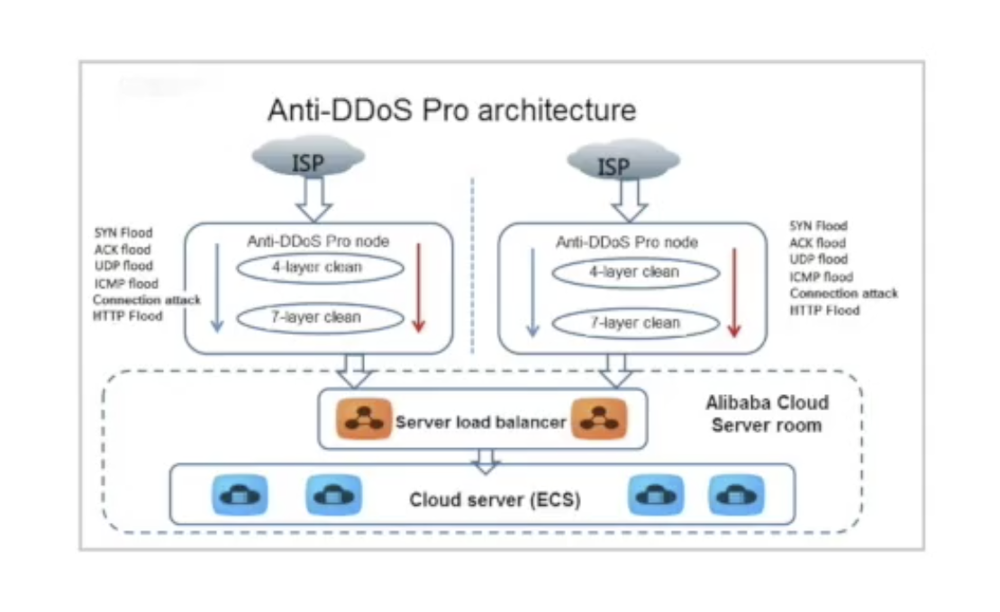

### Alibaba Cloud SSL Certificates Service
- Allows customers to directly apply, purchase and manage SSL certificates on Alibaba Cloud.
- Offered in cooperation with qualified certificate authorities.
### Benefit
- **Ease of Use**: Manage digital certificates on a unified platform.
- **Security**: Allows customers to directly apply, purchase and manage SSL certificates on Alibaba Cloud.
- **Scalability**: Offered in cooperation with qualified certificate authorities.