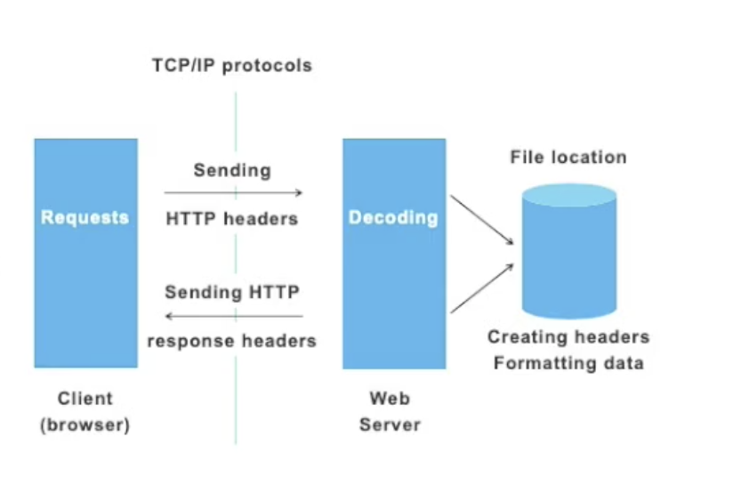
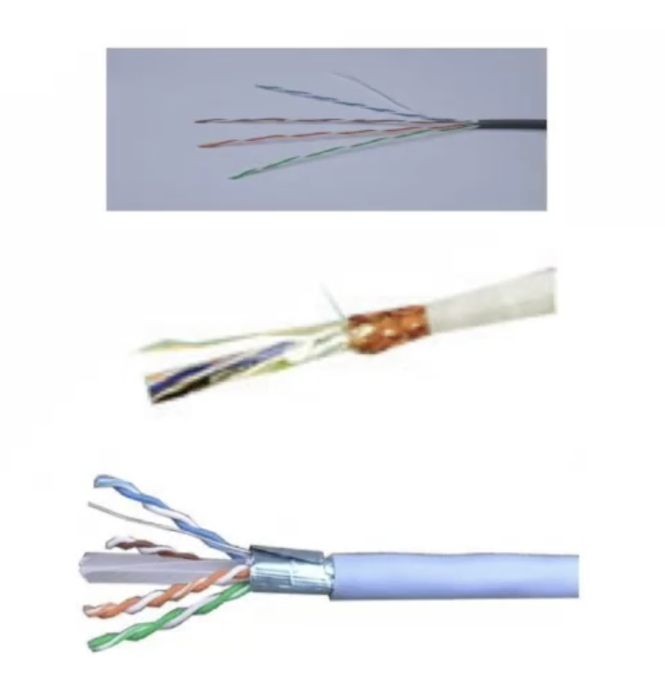

# AliCloud Network Sepcialty Course Notes - Beginner

## Session 1 - Network Fundamentals

### OSI Model
- Open System Interconnection
- Basis of the network communication
- Aimed to standardize the communication between different systems
- Seven layers of data transmission are defined in OSI model
- Can be roughly defined as data flow layer and application layer

- Application: Telnet / HTTP
> End application programs OR services used by end application program.
- Persistation: ASCII / EBCDIC / JPEG
> This layer provides data coding for integers, floats, etc, data compression and secure transmission using cryptography.
- Session: Operation System / Application Access Scheduling
> This layer allows sessions to be established between different machines. Transferring a file from one machine to another
 - Transport: TCP / UDP
 > End to end connections: handles transportation issues between hosts, ensures data transport reliability and flow control
 - Network: IP / IPX
 > This layer adds header information to each package to uniquely address hosts in the network. Routing information is kept in tables or built dynamically.
 - Data link:
> Data to be sent is broken into frames and transmitted. This layer needs to be able to recognize a frame in a raw bit stream.
- Physical:
> The lowest layer and is concerned with wiring and electrical standards.

### Data encapsulating
- Data can only be transferred in one layer with corresponding package header.
- Basically all data is transferred to in a physical layer.
- The application layer data needs to be encapsulated layer by layer from top to bottom before being sent out in order to be transferred into the physical layer.

- The data needs to be de-encapsulated layer by layer from the bottom up after arrving to the destination layer.
- The data can be recognized by the target application after all the data headers have been de-encapsulated.

### ARP Protocol
- Address resolution protocol.
- Used to discover MAC address according to the IP address.
- Worked in OSI data link layer

### TCP Protocol
- Transmission control protocol.
- Worked in OSI transport layer.
- Aimed to provides reliable, ordered, error-checked data transferring via IP network.
- Used IP+Port to define a communication endpoint.
- Connections must be established in a 3-steps handshake process before entering the data transfer phase.

### HTTP Protocol
- Hpyer Text Transfer Protocol.
- Works in OSI application layer.
- Aimed to exchange or transfer Hpyer text.
- Foundation of data communication for world wide web.
- Functions as a request-response protocol in the client-server computing model to achieve information transferring.

### IP address architecture
- Internet Protocol Address.
- Consist of four octets.
- Each octet is 8 bit size number (0 - 255).
- Uniquely indentify a host or device on one network.

### Subnet Mask
- Used to define the network bit and host bit of one IP address.
- From the combination pf IP address and subnet mask we can get which network one IP is located in.
- Subnet mask cab be in format of dot-decimal notation like an address(x.x.x.x) or in format of bit number from 1-32.

### IP Address Classfification
- All the IPv4 addresses are classified into five part.
- Class A have the most IP addresses and become less to less from B to E.
- Just class A to C will adopted in the host environment. Class D and E is used in some special conditions.

### Private IP addresses
- The internet Assigned Numbers Anthority (IANA) reserves the following IP address blocks for use as private IP addresses.
- The first set of IP addresses 10.x.x.x allow for over 16 million addresses.
- The second 172.[16-31].x.x for over 1 million addresses.
- Over 65,000 for the last range 192.168.x.x

### Sepcial Reserved Addresses
- Another range of private IP addresses is 169.254.0.0 to 169.254.255.255 but is for Automatic Private IP Addressing (APIPA) use only.
- In 2012, the IANA allocated 4 million addresses of 100.64.0.0./10 for use in carrier-grade NAT environments.

### Ethernet Cables
- Cat 5: 
> 100Base-TX and 100Base-T4 for 100Mbps  
Support data communications up to 100MHz  
The transmission frequecy is 100MHz  
Mainly used for 100base-T and 10base-T networks.

- Cat 5E: 
> Data transmission for voice transmission and maximum transmission rate of 1000Mbps.

- Cat 6:
> The transmission frequecy is 200MHz  
Compatible with Cat3, Cat5, and Cat 5E cabling products.  
Can be used as a so.

### Ethernet Table

### Hardware Vendors
