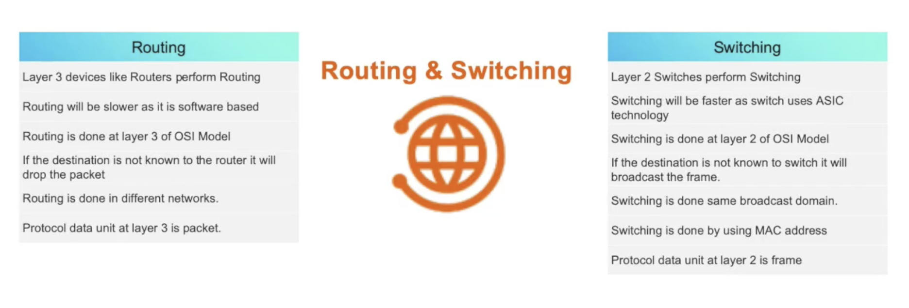

# Switch and Routing

## 1 - What is switching and routing

### Switching and Routing

### Devices
- Normally hosts are connected with Switchs, which are the most widely used layer-2 network devices.
- Switchs normally have many ports to connect with hosts.
- When several layer-2 networks need to connect with each other, routers will be adopted to provide the layer-3 communication.
- Routers normally have less ports than switchs since they just connect several core switches.
- Layer-3 switches can also as routers.

## 2 - L2 network - VLAN and Trunking

### VLAN
- Virtual Local Area Network
- Isolated broadcast domain at the data link layer (OSI layer 2)
- Configured on switches
- Normally different VLANs for different applications or businesses

### Trunking
- Normally the default port mode on switch is access mode.
- Access mode port is normally connected with hosts and can only be configured in one single VLAN.
- The connection between layer-2 switches should be configured in trunk mmode.
- Trunk mode port cab achieve multiple VLAN data transfer via one single switch port.

## 3 - L3 network - Routing and NAT

### Routing
- When data needs to transferred between different networks, routing will be used to find the correct path to each networks.
- There will be a routing table on each router to store the router information.
- For each router in the routing table, it will show you the next hoop IP address/interface of corresponding destination IP address.
- The package will find the next hoop IP in the routing table then go to next hoop, then repeat the previous step until reach the destination.

### Static Route
- Uses a route that a network administrator enters into the router manually.
- The routing table needs to be maintained manually.
- Full control of the routing information.
- Routing path redundancy is hard to design and maintain.
- Routing status is stable.

### Dynamic Route
- Used Dynamic route protocol, like OSPF, BGP, to generate and maintain the routing table.
- Can be combined with static route.
- Dynamic route can help to achieve routing path redundancy.
- Routing status may be unstable when network topology is changed.

### Default Route
- Route for all destination IP address.
- Will be adopted when packages can not find corresponding route information in the route table.
- Default route has the lowest priority in routing table.

### NAT
- NAT protects network security because private networks are note advertised.
- NAT allows an organization with unregistered private addresses to connect to the internet translating those addresses into globally registered IP addresses.
- Overloading is a form of dynamic NAT that maps multiple unregistered IP addresses to a single registered IP address (many-to-one) by using different ports, known also as PAT.
- Sometimes NAT is blamed for IP connectivity problems when there is a actually a routing problem.

## 4 - Alibaba Cloud Network Solution - VPC

### VPC
- Virtual Private Cloud.
- Dedicated private network established in Alibaba Cloud.
- Software defined network environment which is isolated outside.
- You can design your own network architecture and IP segmentation as you want without limited by the existing network design.

### vSwitch
- Virtual Switch
- Used to provide the connectivity for cloud services (ECS. RDS...) in the same IP subnet (layer-2 network)
- You can create multiple vSwitches for multiple IP subnets.

### vRouter
- Virtual Router.
- Used to provide the connectivity between different vSwitches.
- Automatically created when VPC is created.
- Only one vRouter in one VPC and you cannot manually create more vRouter.

### EIP
- Elastic IP
- Used to provide internet connection for the ECS instance in the VPC.
- Host outside of the VPC can visit ECS instance via EIP.
- ECS in VPC can visit the internet by NAT to EIP.
- EIP can be bonded with any ECS instance as required but can only be bonded with one ECS instance at one moment.

### NAT Gateway 
- Used to provide comprehensive NAT service for Cloud services in the VPC.
- NAT gateway need to be bonded with EIP then provide NAT gateway service.
- Provide SNAT to establish connection from VPC inside to internet.
- Provide DNAT to establish connection from internet to VPC.
- DNAT can achieve multiple ECS instances share one EIP to provide services on multiple port on one single EIP.

### NAT Gateway VS EIP

