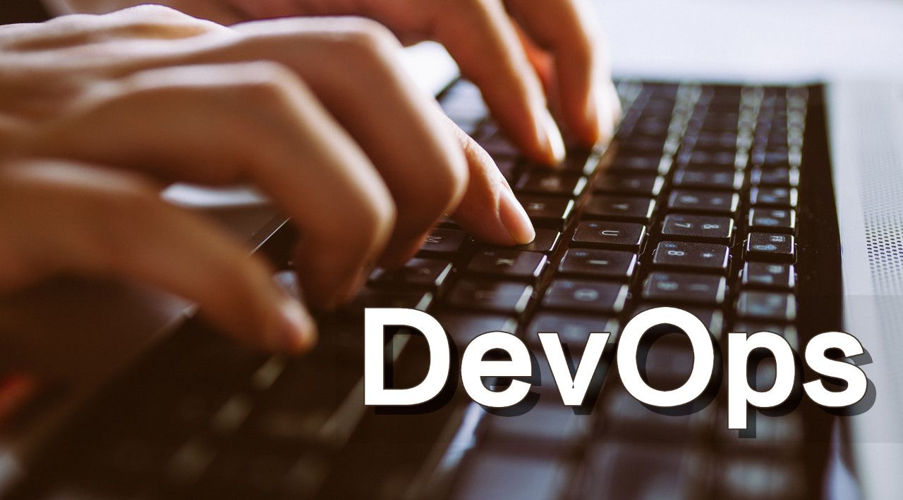
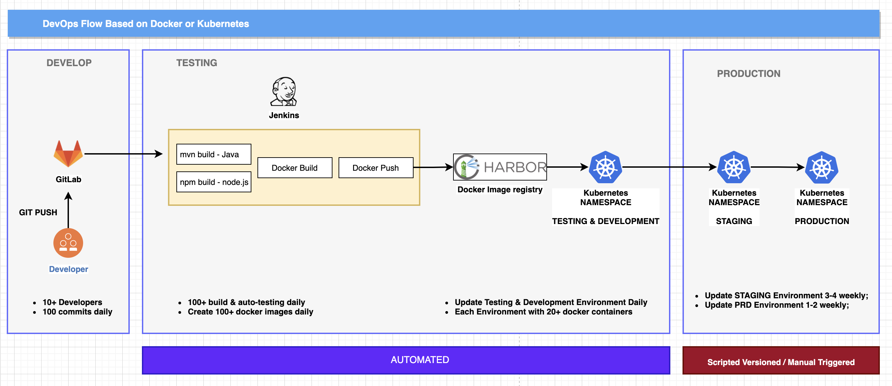

# DevOps Introduction

> What is DevOps?  
>
> Some people say it is a method, and some people say it is a tool, and some people say it is a spirit. What's more, say it is a philosophy. 
>
> So let's start ~

## 1. The Origin of DevOps

> As we known,  a software from zero to final devlivery.

- If the software is not so huge and complicated, one developer can handle all steps and even do 7*24 support;
- However, the software is growing and chaning all the time, only one person already cannot handle all steps.  **If he/she can, 996 & 007 is welcoming.**
- Also with the growth of software  team, not all software engineer do the developing work; Also will be divided into **QA Engineer, Opearation Engineer and support Engineer**

> So the software delivery process should be as below:

- So the **Traditional Software Development Process** should be divived into three steps:  
  - Development;
  - Testing (QA);
  - Operation;
- At same time, all of these roles follow the **Water-Fall Model** as software deliery model;

> However, With the system changing & growing from user's requirements. The software cycle time is becaming more and more demanding;

- So **Software Development Team** have a new concept is **Agile Development** at 2000;
- CI  - Continuous Integration;
- CD - Continuous Delivery or Continuous Deployment;

> Comparison between Water-Fall and Agile:

> Risk between Water-Fall and Agile:

Although Agile improve the efficiency og software development and version release, but new bottleneck of software cycle is on opeartion side

- The Core value of Operation Team is stable not changing;
- The Core Vaue of Agile Team (Developemt & Testing) is changing;

**So DevOps is coming~**

## 2. What is DevOps

> DevOps is a word that is used to describe a set of modern IT practices which seek to more closely bring together software *dev*elopers and *op*erations staff to work on the same project in a more collaborative manner. The desire is that by breaking down barriers which have traditionally existed between these two sides of the IT department, organizations can reduce the time and friction involved in deploying new versions of software. This effort will ideally lead to shorter development cycles which ideally may save time and money, and give the organization a competitive edge against others with longer, more traditional development cycles.

> WiKi DevOps:
>
> **DevOps** is a set of practices that combines [software development](https://en.wikipedia.org/wiki/Software_development) (*Dev*) and [IT operations](https://en.wikipedia.org/wiki/IT_operations) (*Ops*). It aims to shorten the [systems development life cycle](https://en.wikipedia.org/wiki/Systems_development_life_cycle) and provide [continuous delivery](https://en.wikipedia.org/wiki/Continuous_delivery) with high [software quality](https://en.wikipedia.org/wiki/Software_quality). DevOps is complementary with [Agile software development](https://en.wikipedia.org/wiki/Agile_software_development); several DevOps aspects came from the Agile methodology.

**So What is DevOps?**

- From Concept Side, Seems a little abstract; But DevOps is not the name of a specific software tool or platform. **Should be IT Management Style or IT Culture**
- From Target Side, DevOps is to make developers and operators to communicate well and cooperate through automation processes, making the software overall process more quickly and reliable.
- From Function side, it includes lots of paltform & tools.

>  Comparison with Water-Fall, Agile and DevOps:

> The Value of DevOps:

> Another Explanation between Agile and DevOps:

## 3. DevOps ToolChain

> **What is a DevOps toolchain?**
>
> A good DevOps toolchain is a progression of different DevOps tools used to address a specific business challenge. Connected in a chain, they guarantee a profitable cycle between the front-end and back-end developers, quality analyzers, and customers. The goal is to automate development and deployment processes to ensure the rapid, reliable, and budget-friendly delivery of innovative solutions.

### Why you need a DevOps Chain?

1. **Faster and more efficient product deployments:** DevOps tools automate most of the software development process. This results in the agile delivery of innovative products and solutions that leave the business far ahead of the competition.
2. **Budget and time optimization:** Automating manual tasks ensures that your organization saves time and resources. Once there are no additional costs incurred from natural human errors or insufficient time management, the budget is naturally optimized.
3. **Efficient development:** A DevOps toolchain makes the development process more efficient by removing unnecessary delays between the different aspects of development work. The work of front-end and back-end developers and quality testers is synchronized, so no one waits for the other team members to deliver their part so they can take over.
4. **Faster deployment means higher quality:** A DevOps toolchain guarantees that defects are resolved quickly and skillfully to achieve the best quality with a faster deployment process. How? It enables the generation of targeted alerts that notify your team of major incidents. This allows you to proactively stop potential problems from escalating and damaging your customer service.
5. **Timely incident management:** A DevOps toolchain helps refine your incident management record. It does this by identifying IT incidents and escalating them specifically towards the right team members, then following through until the issues are resolved. This means messages are received and acted upon quickly because they're correctly targeted.

### A DevOps Toolchain in Action:

1. First, the team wrote automated tests that immediately identified changes to the application's initial version (the **source control/version control DevOps** phase).
2. Once the new version was ready, the code was committed to GitLab.
3. Through GitLab, the commit automatically started a Jenkins build.
4. In **continuous integration**, the new code version was tested with mvn or npm to check whether it operated correctly.
5. When the tests passed successfully, the **continuous delivery phase** automatically started and created a ready-to-use Docker image in Harbor;
6. Finally, the new version of the application was downloaded from Harbor and deployed to a live environment on kubernetes, e.g., [Docker](https://opensource.com/resources/what-docker) containers (the **continuous deployment phase**).

# Reference:

1. [Enterprise DevOps Report 2020-2021](https://azure.microsoft.com/en-us/resources/enterprise-devops-report-20202021/)
2. [AWS - What is DevOps](https://aws.amazon.com/devops/what-is-devops/?nc1=h_ls)
3. [Agile Methodologies: Transforming Organizations to Minimize Errors and Costs](https://www.ie.edu/insights/articles/agile-methodologies-transforming-organizations-to-minimize-errors-and-costs/)

