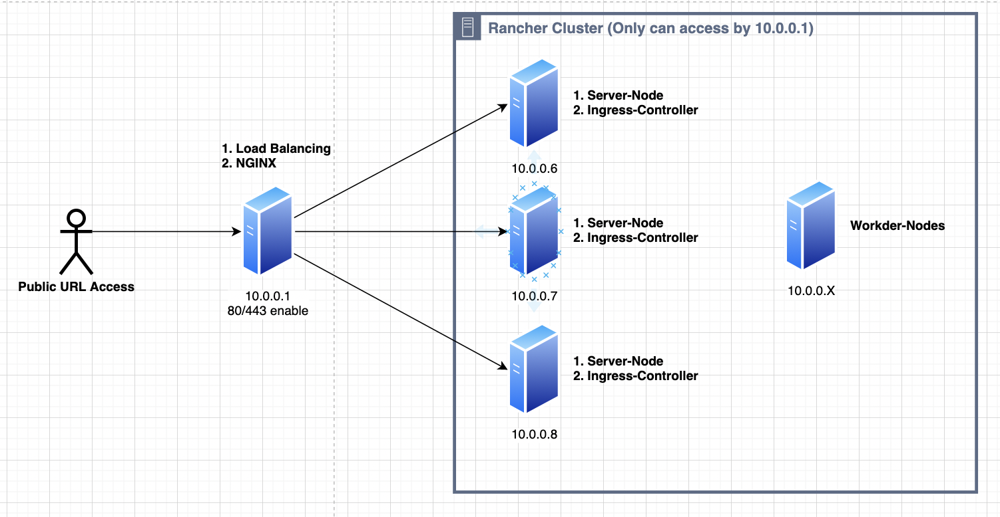
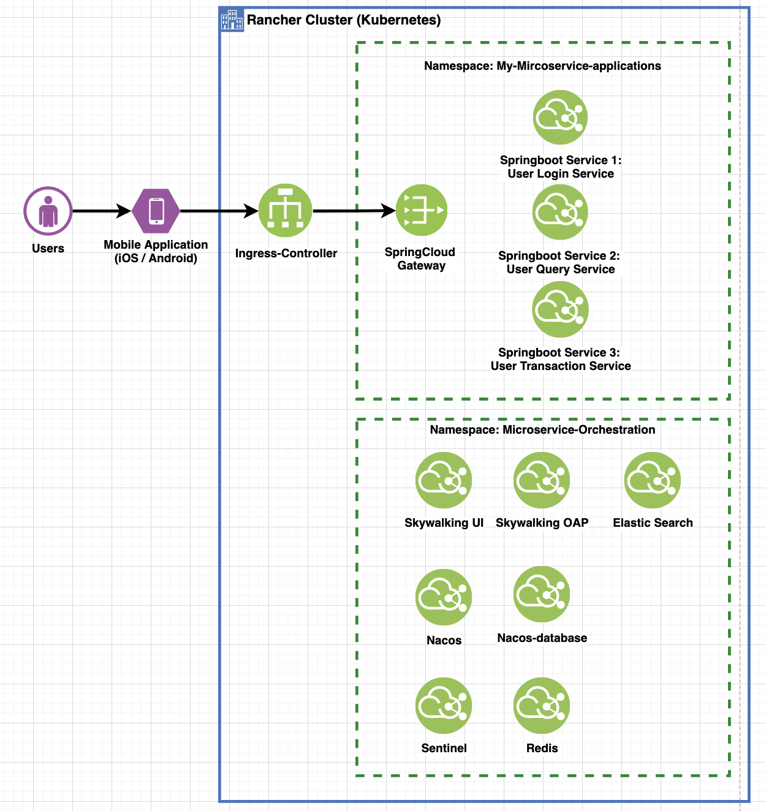

# System Architecture for Microservice

> This topic is foucus on the Microservice System Architecture on Aliyun and On-permise Data Centre
>
> And noticed that the price model on aliyun is folating and some serive is alway on-demand which only can estimate as a range rather than a given price monthly.

## 1. On-permise System Architecure

> Since we need a HA kubernetes at on-permise environment,  only using kubernetes is not good enough, which you will spend lots of time on maintenance and operation with kubernetes; So Rancher (2.x) is a good option for enterprise internal usage;

#### 1.1 Recommended Architecture

- Rancher's DNS should resolve to Layer 4 (TCP) load balancing. Using NGINX~
- Load balancing should forward port TCP / 80 and TCP / 443 to all 3 nodes in the Kubernes cluster.
- Ingress-controller redirects HTTP to HTTPS and terminates SSL / TLS on port TCP / 443 (SSL digital certificate deployed here).
- Ingress-controller forwards traffic to the TCP / 80 port of the POD.

#### 1.2 Recommended Servers:

- **One** Linux server,  using for four-layer load balancing;
- **Three** Linux servers, Rancker-Server-Node nodes;
- **N** Linux servers, Rancker-Agent-Node node (n <= 50);

#### 1.3 VM System Specifications: 

| NODE              | IP             | **VM System Sepcification**                                  | Notes                 | Ports                                         |
| ----------------- | -------------- | ------------------------------------------------------------ | --------------------- | --------------------------------------------- |
| NODE-LB           | 10.0.0.1       | ubuntu 18.04(64-bit x86) / 4 vcpu / 8 g / 100G Storage Disk or other Linux | Load Balancing        | 80/443                                        |
| NODE-SERVER-1     | 10.0.0.6       | ubuntu 18.04(64-bit x86) / 4 vcpu / 8 g / 100G Storage Disk or other Linux | Rancher master node 1 | open all for this VPC, close all for external |
| NODE-SERVER-2     | 10.0.0.7       | ubuntu 18.04(64-bit x86) / 4 vcpu / 8 g / 100G Storage Disk or other Linux | Rancher master node 2 | open all for this VPC, close all for external |
| NODE-SERVER-3     | 10.0.0.8       | ubuntu 18.04(64-bit x86) / 4 vcpu / 8 g / 100G Storage Disk or other Linux | Rancher master node 3 | open all for this VPC, close all for external |
| NODE-WORKER-(1~3) | 10.0.0.16 ~ 18 | ubuntu 18.04(64-bit x86) / 4 vcpu / 8 g / 100G Storage Disk or other Linux | Worker nodes          | open all for this VPC, close all for external |

#### 1.4 Detail System Architecure

## 2. Aliyun's K8s - (for one k8s in Aliyun - HK Region)

| Cloud Service                                  | Cloud Service Specificaiton                                  | Pirce - Monthly                                              | Qty  |
| ---------------------------------------------- | ------------------------------------------------------------ | ------------------------------------------------------------ | ---- |
| AliCloud Managed Kubernetes                    | Kubernetes Version - 1.20.4-aliyun.1 Docker 19.03.15 Flannel Networking | 67.5 USD                                                     | 1    |
| Elastic Cloud Computing Service - Worker Nodes | ecs.hfc6.xlarge (4vCPU, 8GiB) 120 GB Disk Storage            | 407.94 USD                                                   | 3    |
| SNAT - Load Balanceing Service                 | slb.s2.medium and networking is demanding                    | Service is 0.319 per/hour ; Networking is 0.156/GB; So the total month is 81.75 USD + 0.156/GB | 1    |
| Ingress - Load Balanceing Service              | slb.s2.medium and networking is demanding                    | Service is 0.319 per/hour ; Networking is 0.156/GB; So the total month is 81.75 USD + 0.156/GB | 1    |
| **Total Price**                                | **638.84 USD + Networking Price**                            | **Networing Price os 0.156\*2 = 0.312 USD per/GB**           |      |

> **If Choose fixed 5 Mbps Bandwidth: The networking price can be estimated 104.25USD per month per Load Balanceing**

**k8s already can be regraded as a basic service on aliyun platform, with the development of Cloud Native Concept, there are some other recommended tools:**

- EDAS: https://help.aliyun.com/product/29500.html?spm=a2c4g.11186623.3.2.19693c103LVjsy
- MES: https://help.aliyun.com/product/123350.html

## 3.  Microservice Applications

| Namespace                  | Docker Image Name                      | Ports             | Notes                                         |
| -------------------------- | -------------------------------------- | ----------------- | --------------------------------------------- |
| Mircoservice-Orchestration | nacos/nacos-server                     | 8848, 9848,  9849 | configuration and service registration center |
| Mircoservice-Orchestration | nacos/nacos-mysql:5.7                  | 3306              | persist data of nacos                         |
| Mircoservice-Orchestration | redis:latest                           | 6379              | for distribution lock usage                   |
| Mircoservice-Orchestration | bladex/sentinel-dashboard:1.8.0        | 321000            | Flow Control                                  |
| Mircoservice-Orchestration | apache/skywalking-oap-server:8.5.0-es7 | 11800, 12800      | data collector                                |
| Mircoservice-Orchestration | apache/skywalking-ui:8.5.0             | 8000              | Applicaiton Trace & Monotroing                |
| Mircoservice-Orchestration | elasticsearch:7.5.1                    | 9200,9300         | persist data of skywalking                    |

