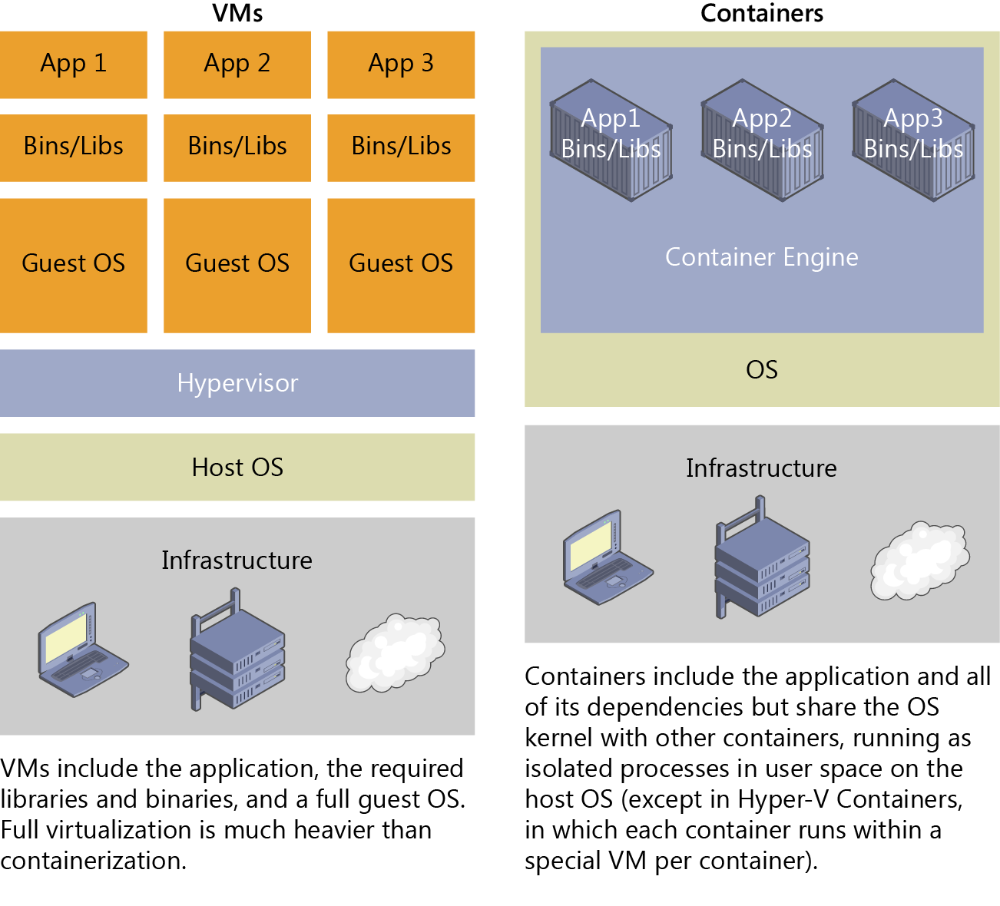

# Docker with GitLab CI/CD

#### 1. Docker Introduction:

#### 2. DevOps Toolchain in Action: 

1. First, the team wrote automated tests that immediately identified changes to the application's initial version (the **source control/version control DevOps** phase).
2. Once the new version was ready, the code was committed to GitLab.
3. Through GitLab, the commit automatically started a Jenkins build.
4. In **continuous integration**, the new code version was tested with mvn or npm to check whether it operated correctly.
5. When the tests passed successfully, the **continuous delivery phase** automatically started and created a ready-to-use Docker image in Harbor;
6. Finally, the new version of the application was downloaded from Harbor and deployed to a live environment on kubernetes, e.g., [Docker](https://opensource.com/resources/what-docker) containers (the **continuous deployment phase**).

### 3. Current Demo

- Gitlab as  **source control/version control**
- GitLab Runner as **continuous integration and deployment**;
- Php-Apache and Nginx as web hosting;

