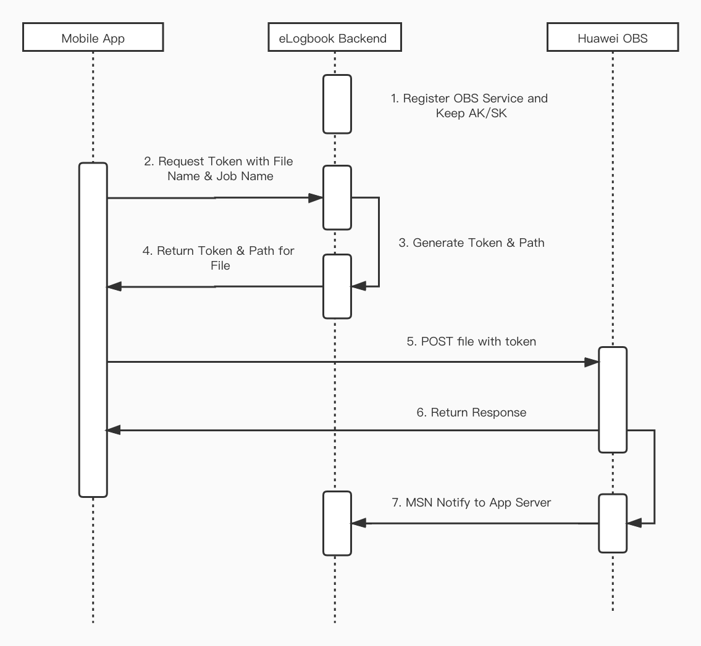

# OBS Service for eLogbook Project

> 1. 使用POST 实现服务端和客户端权限控制和数据上传分离的方法;
> 2. React Native 如果不考虑集成Native SDK的方法的情况下，如果采用 JavaScript SDK 等客户端直接签名时，AccessKeyID和AcessKeySecret会暴露在前端页面，因此存在严重的安全隐患;
> 3. 所以需要后端App 服务器提供上传文件的鉴权token;
> 4. 当 React Native Side 完成文件上传之后 OBS可以回调Backend API 通知文件上传状态;

## 1. Application Flow: Upload files to Huawei OBS

## 2. Reference:

- [OBS服务应用于互联网数据上传时 使用POST 实现服务端和客户端权限控制和数据上传分离的方法](https://bbs.huaweicloud.com/blogs/109829)
- [web/移动端数据上传或下载对接对象存储OBS应用框架和搭建](https://bbs.huaweicloud.com/blogs/136899)
- [JAVA实现服务端获取签名后前端直传文件到oss服务器：前端到后端](https://blog.csdn.net/qq_44682266/article/details/108258326)
- [OBS 事件通知 - MSN](https://support.huaweicloud.com/ugobs-obs/obs_41_0045.html)`