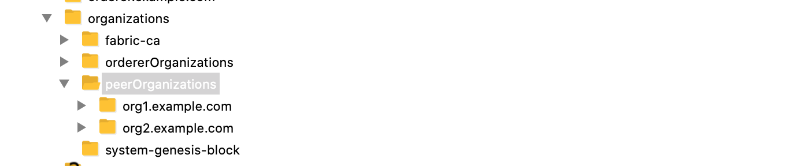

# 基于 Hyperledger Fabric v2.2.1 的多机部署 (四)
> 创建联盟，并且生成创世块 并且启动 Ordering Service

## A. 创建创世块 system-genesis-block
> 这一步需要 基于 Hyperledger Fabric v2.2.1 的多机部署 (三) 中所有的CA文件放置到orderer这部机器上

### 1. 文件结构如下所示：


### 2. 使用 configtxgen 创建创世块准备工作
```
# Create paths for system-genesis-block
cd ~/organizations
mkdir -p system-genesis-block
```
> 准备 configtx.yaml 并上传到 ~/organizations
```
# Copyright IBM Corp. All Rights Reserved.
#
# SPDX-License-Identifier: Apache-2.0
#

---
################################################################################
#
#   Section: Organizations
#
#   - This section defines the different organizational identities which will
#   be referenced later in the configuration.
#
################################################################################
Organizations:

    # SampleOrg defines an MSP using the sampleconfig.  It should never be used
    # in production but may be used as a template for other definitions
    - &OrdererOrg
        # DefaultOrg defines the organization which is used in the sampleconfig
        # of the fabric.git development environment
        Name: OrdererOrg

        # ID to load the MSP definition as
        ID: OrdererMSP

        # MSPDir is the filesystem path which contains the MSP configuration
        MSPDir: ./ordererOrganizations/example.com/msp

        # Policies defines the set of policies at this level of the config tree
        # For organization policies, their canonical path is usually
        #   /Channel/<Application|Orderer>/<OrgName>/<PolicyName>
        Policies:
            Readers:
                Type: Signature
                Rule: "OR('OrdererMSP.member')"
            Writers:
                Type: Signature
                Rule: "OR('OrdererMSP.member')"
            Admins:
                Type: Signature
                Rule: "OR('OrdererMSP.admin')"

        OrdererEndpoints:
            - orderer.example.com:7050

    - &Org1
        # DefaultOrg defines the organization which is used in the sampleconfig
        # of the fabric.git development environment
        Name: Org1MSP

        # ID to load the MSP definition as
        ID: Org1MSP

        MSPDir: ./peerOrganizations/org1.example.com/msp

        # Policies defines the set of policies at this level of the config tree
        # For organization policies, their canonical path is usually
        #   /Channel/<Application|Orderer>/<OrgName>/<PolicyName>
        Policies:
            Readers:
                Type: Signature
                Rule: "OR('Org1MSP.admin', 'Org1MSP.peer', 'Org1MSP.client')"
            Writers:
                Type: Signature
                Rule: "OR('Org1MSP.admin', 'Org1MSP.client')"
            Admins:
                Type: Signature
                Rule: "OR('Org1MSP.admin')"
            Endorsement:
                Type: Signature
                Rule: "OR('Org1MSP.peer')"

        # leave this flag set to true.
        AnchorPeers:
            # AnchorPeers defines the location of peers which can be used
            # for cross org gossip communication.  Note, this value is only
            # encoded in the genesis block in the Application section context
            - Host: peer0.org1.example.com
              Port: 7051

    - &Org2
        # DefaultOrg defines the organization which is used in the sampleconfig
        # of the fabric.git development environment
        Name: Org2MSP

        # ID to load the MSP definition as
        ID: Org2MSP

        MSPDir: ./peerOrganizations/org2.example.com/msp

        # Policies defines the set of policies at this level of the config tree
        # For organization policies, their canonical path is usually
        #   /Channel/<Application|Orderer>/<OrgName>/<PolicyName>
        Policies:
            Readers:
                Type: Signature
                Rule: "OR('Org2MSP.admin', 'Org2MSP.peer', 'Org2MSP.client')"
            Writers:
                Type: Signature
                Rule: "OR('Org2MSP.admin', 'Org2MSP.client')"
            Admins:
                Type: Signature
                Rule: "OR('Org2MSP.admin')"
            Endorsement:
                Type: Signature
                Rule: "OR('Org2MSP.peer')"

        AnchorPeers:
            # AnchorPeers defines the location of peers which can be used
            # for cross org gossip communication.  Note, this value is only
            # encoded in the genesis block in the Application section context
            - Host: peer0.org2.example.com
              Port: 7051

################################################################################
#
#   SECTION: Capabilities
#
#   - This section defines the capabilities of fabric network. This is a new
#   concept as of v1.1.0 and should not be utilized in mixed networks with
#   v1.0.x peers and orderers.  Capabilities define features which must be
#   present in a fabric binary for that binary to safely participate in the
#   fabric network.  For instance, if a new MSP type is added, newer binaries
#   might recognize and validate the signatures from this type, while older
#   binaries without this support would be unable to validate those
#   transactions.  This could lead to different versions of the fabric binaries
#   having different world states.  Instead, defining a capability for a channel
#   informs those binaries without this capability that they must cease
#   processing transactions until they have been upgraded.  For v1.0.x if any
#   capabilities are defined (including a map with all capabilities turned off)
#   then the v1.0.x peer will deliberately crash.
#
################################################################################
Capabilities:
    # Channel capabilities apply to both the orderers and the peers and must be
    # supported by both.
    # Set the value of the capability to true to require it.
    Channel: &ChannelCapabilities
        # V2_0 capability ensures that orderers and peers behave according
        # to v2.0 channel capabilities. Orderers and peers from
        # prior releases would behave in an incompatible way, and are therefore
        # not able to participate in channels at v2.0 capability.
        # Prior to enabling V2.0 channel capabilities, ensure that all
        # orderers and peers on a channel are at v2.0.0 or later.
        V2_0: true

    # Orderer capabilities apply only to the orderers, and may be safely
    # used with prior release peers.
    # Set the value of the capability to true to require it.
    Orderer: &OrdererCapabilities
        # V2_0 orderer capability ensures that orderers behave according
        # to v2.0 orderer capabilities. Orderers from
        # prior releases would behave in an incompatible way, and are therefore
        # not able to participate in channels at v2.0 orderer capability.
        # Prior to enabling V2.0 orderer capabilities, ensure that all
        # orderers on channel are at v2.0.0 or later.
        V2_0: true

    # Application capabilities apply only to the peer network, and may be safely
    # used with prior release orderers.
    # Set the value of the capability to true to require it.
    Application: &ApplicationCapabilities
        # V2_0 application capability ensures that peers behave according
        # to v2.0 application capabilities. Peers from
        # prior releases would behave in an incompatible way, and are therefore
        # not able to participate in channels at v2.0 application capability.
        # Prior to enabling V2.0 application capabilities, ensure that all
        # peers on channel are at v2.0.0 or later.
        V2_0: true

################################################################################
#
#   SECTION: Application
#
#   - This section defines the values to encode into a config transaction or
#   genesis block for application related parameters
#
################################################################################
Application: &ApplicationDefaults

    # Organizations is the list of orgs which are defined as participants on
    # the application side of the network
    Organizations:

    # Policies defines the set of policies at this level of the config tree
    # For Application policies, their canonical path is
    #   /Channel/Application/<PolicyName>
    Policies:
        Readers:
            Type: ImplicitMeta
            Rule: "ANY Readers"
        Writers:
            Type: ImplicitMeta
            Rule: "ANY Writers"
        Admins:
            Type: ImplicitMeta
            Rule: "MAJORITY Admins"
        LifecycleEndorsement:
            Type: ImplicitMeta
            Rule: "MAJORITY Endorsement"
        Endorsement:
            Type: ImplicitMeta
            Rule: "MAJORITY Endorsement"

    Capabilities:
        <<: *ApplicationCapabilities
################################################################################
#
#   SECTION: Orderer
#
#   - This section defines the values to encode into a config transaction or
#   genesis block for orderer related parameters
#
################################################################################
Orderer: &OrdererDefaults

    # Orderer Type: The orderer implementation to start
    OrdererType: etcdraft
    
    # Addresses used to be the list of orderer addresses that clients and peers
    # could connect to.  However, this does not allow clients to associate orderer
    # addresses and orderer organizations which can be useful for things such
    # as TLS validation.  The preferred way to specify orderer addresses is now
    # to include the OrdererEndpoints item in your org definition
    Addresses:
        - orderer.example.com:7050

    EtcdRaft:
        Consenters:
        - Host: orderer.example.com
          Port: 7050
          ClientTLSCert: ./ordererOrganizations/example.com/orderers/orderer.example.com/tls/server.crt
          ServerTLSCert: ./ordererOrganizations/example.com/orderers/orderer.example.com/tls/server.crt

    # Batch Timeout: The amount of time to wait before creating a batch
    BatchTimeout: 2s

    # Batch Size: Controls the number of messages batched into a block
    BatchSize:

        # Max Message Count: The maximum number of messages to permit in a batch
        MaxMessageCount: 10

        # Absolute Max Bytes: The absolute maximum number of bytes allowed for
        # the serialized messages in a batch.
        AbsoluteMaxBytes: 99 MB

        # Preferred Max Bytes: The preferred maximum number of bytes allowed for
        # the serialized messages in a batch. A message larger than the preferred
        # max bytes will result in a batch larger than preferred max bytes.
        PreferredMaxBytes: 512 KB

    # Organizations is the list of orgs which are defined as participants on
    # the orderer side of the network
    Organizations:

    # Policies defines the set of policies at this level of the config tree
    # For Orderer policies, their canonical path is
    #   /Channel/Orderer/<PolicyName>
    Policies:
        Readers:
            Type: ImplicitMeta
            Rule: "ANY Readers"
        Writers:
            Type: ImplicitMeta
            Rule: "ANY Writers"
        Admins:
            Type: ImplicitMeta
            Rule: "MAJORITY Admins"
        # BlockValidation specifies what signatures must be included in the block
        # from the orderer for the peer to validate it.
        BlockValidation:
            Type: ImplicitMeta
            Rule: "ANY Writers"

################################################################################
#
#   CHANNEL
#
#   This section defines the values to encode into a config transaction or
#   genesis block for channel related parameters.
#
################################################################################
Channel: &ChannelDefaults
    # Policies defines the set of policies at this level of the config tree
    # For Channel policies, their canonical path is
    #   /Channel/<PolicyName>
    Policies:
        # Who may invoke the 'Deliver' API
        Readers:
            Type: ImplicitMeta
            Rule: "ANY Readers"
        # Who may invoke the 'Broadcast' API
        Writers:
            Type: ImplicitMeta
            Rule: "ANY Writers"
        # By default, who may modify elements at this config level
        Admins:
            Type: ImplicitMeta
            Rule: "MAJORITY Admins"

    # Capabilities describes the channel level capabilities, see the
    # dedicated Capabilities section elsewhere in this file for a full
    # description
    Capabilities:
        <<: *ChannelCapabilities

################################################################################
#
#   Profile
#
#   - Different configuration profiles may be encoded here to be specified
#   as parameters to the configtxgen tool
#
################################################################################
Profiles:

    TwoOrgsOrdererGenesis:
        <<: *ChannelDefaults
        Orderer:
            <<: *OrdererDefaults
            Organizations:
                - *OrdererOrg
            Capabilities:
                <<: *OrdererCapabilities
        Consortiums:
            SampleConsortium:
                Organizations:
                    - *Org1
                    - *Org2
    TwoOrgsChannel:
        Consortium: SampleConsortium
        <<: *ChannelDefaults
        Application:
            <<: *ApplicationDefaults
            Organizations:
                - *Org1
                - *Org2
            Capabilities:
                <<: *ApplicationCapabilities
```

> configtxgen 创建创世块
```
configtxgen -configPath . -profile TwoOrgsOrdererGenesis -channelID system-channel -outputBlock ./system-genesis-block/genesis.block
```

## B. 使用 Docker 开启 Orderer Service
> 这一步其实十分关键，如果 Hyperledger Fabric v2.2.1 的多机部署 (三) 的部署出现错误都会在这一步验证出来。

```
# Create Docker Orderer Volume Dir 
mkdir -p ~/orderer.example.com

docker run --rm -d \
--name orderer.example.com \
-e FABRIC_LOGGING_SPEC=INFO \
-e ORDERER_GENERAL_LISTENADDRESS=0.0.0.0 \
-e ORDERER_GENERAL_LISTENPORT=7050 \
-e ORDERER_GENERAL_GENESISMETHOD=file \
-e ORDERER_GENERAL_GENESISFILE=/var/hyperledger/orderer/orderer.genesis.block \
-e ORDERER_GENERAL_LOCALMSPID=OrdererMSP \
-e ORDERER_GENERAL_LOCALMSPDIR=/var/hyperledger/orderer/msp \
-e ORDERER_GENERAL_TLS_ENABLED=true \
-e ORDERER_GENERAL_TLS_PRIVATEKEY=/var/hyperledger/orderer/tls/server.key \
-e ORDERER_GENERAL_TLS_CERTIFICATE=/var/hyperledger/orderer/tls/server.crt \
-e ORDERER_GENERAL_TLS_ROOTCAS=[/var/hyperledger/orderer/tls/ca.crt] \
-e ORDERER_KAFKA_TOPIC_REPLICATIONFACTOR=1 \
-e ORDERER_KAFKA_VERBOSE=true \
-e ORDERER_GENERAL_CLUSTER_CLIENTCERTIFICATE=/var/hyperledger/orderer/tls/server.crt \
-e ORDERER_GENERAL_CLUSTER_CLIENTPRIVATEKEY=/var/hyperledger/orderer/tls/server.key \
-e ORDERER_GENERAL_CLUSTER_ROOTCAS=[/var/hyperledger/orderer/tls/ca.crt] \
-w /opt/gopath/src/github.com/hyperledger/fabric \
-p 7050:7050 \
-v ~/organizations/system-genesis-block/genesis.block:/var/hyperledger/orderer/orderer.genesis.block \
-v ~/organizations/ordererOrganizations/example.com/orderers/orderer.example.com/msp:/var/hyperledger/orderer/msp \
-v ~/organizations/ordererOrganizations/example.com/orderers/orderer.example.com/tls/:/var/hyperledger/orderer/tls \
-v ~/orderer.example.com:/var/hyperledger/production/orderer \
hyperledger/fabric-orderer:2.2.1 orderer


# Check logs within docker container
2020-11-13 03:00:26.529 UTC [localconfig] completeInitialization -> WARN 001 General.GenesisFile should be replaced by General.BootstrapFile
2020-11-13 03:00:26.529 UTC [localconfig] completeInitialization -> INFO 002 Kafka.Version unset, setting to 0.10.2.0
2020-11-13 03:00:26.529 UTC [orderer.common.server] prettyPrintStruct -> INFO 003 Orderer config values:
	General.ListenAddress = "0.0.0.0"
	General.ListenPort = 7050
	General.TLS.Enabled = true
	General.TLS.PrivateKey = "/var/hyperledger/orderer/tls/server.key"
	General.TLS.Certificate = "/var/hyperledger/orderer/tls/server.crt"
	General.TLS.RootCAs = [/var/hyperledger/orderer/tls/ca.crt]
	General.TLS.ClientAuthRequired = false
	General.TLS.ClientRootCAs = []
	General.TLS.TLSHandshakeTimeShift = 0s
	General.Cluster.ListenAddress = ""
	General.Cluster.ListenPort = 0
	General.Cluster.ServerCertificate = ""
	General.Cluster.ServerPrivateKey = ""
	General.Cluster.ClientCertificate = "/var/hyperledger/orderer/tls/server.crt"
	General.Cluster.ClientPrivateKey = "/var/hyperledger/orderer/tls/server.key"
	General.Cluster.RootCAs = [/var/hyperledger/orderer/tls/ca.crt]
	General.Cluster.DialTimeout = 5s
	General.Cluster.RPCTimeout = 7s
	General.Cluster.ReplicationBufferSize = 20971520
	General.Cluster.ReplicationPullTimeout = 5s
	General.Cluster.ReplicationRetryTimeout = 5s
	General.Cluster.ReplicationBackgroundRefreshInterval = 5m0s
	General.Cluster.ReplicationMaxRetries = 12
	General.Cluster.SendBufferSize = 10
	General.Cluster.CertExpirationWarningThreshold = 168h0m0s
	General.Cluster.TLSHandshakeTimeShift = 0s
	General.Keepalive.ServerMinInterval = 1m0s
	General.Keepalive.ServerInterval = 2h0m0s
	General.Keepalive.ServerTimeout = 20s
	General.ConnectionTimeout = 0s
	General.GenesisMethod = "file"
	General.GenesisFile = "/var/hyperledger/orderer/orderer.genesis.block"
	General.BootstrapMethod = "file"
	General.BootstrapFile = "/var/hyperledger/orderer/orderer.genesis.block"
	General.Profile.Enabled = false
	General.Profile.Address = "0.0.0.0:6060"
	General.LocalMSPDir = "/var/hyperledger/orderer/msp"
	General.LocalMSPID = "OrdererMSP"
	General.BCCSP.ProviderName = "SW"
	General.BCCSP.SwOpts.SecLevel = 256
	General.BCCSP.SwOpts.HashFamily = "SHA2"
	General.BCCSP.SwOpts.Ephemeral = true
	General.BCCSP.SwOpts.FileKeystore.KeyStorePath = ""
	General.BCCSP.SwOpts.DummyKeystore =
	General.BCCSP.SwOpts.InmemKeystore =
	General.Authentication.TimeWindow = 15m0s
	General.Authentication.NoExpirationChecks = false
	FileLedger.Location = "/var/hyperledger/production/orderer"
	FileLedger.Prefix = "hyperledger-fabric-ordererledger"
	Kafka.Retry.ShortInterval = 5s
	Kafka.Retry.ShortTotal = 10m0s
	Kafka.Retry.LongInterval = 5m0s
	Kafka.Retry.LongTotal = 12h0m0s
	Kafka.Retry.NetworkTimeouts.DialTimeout = 10s
	Kafka.Retry.NetworkTimeouts.ReadTimeout = 10s
	Kafka.Retry.NetworkTimeouts.WriteTimeout = 10s
	Kafka.Retry.Metadata.RetryMax = 3
	Kafka.Retry.Metadata.RetryBackoff = 250ms
	Kafka.Retry.Producer.RetryMax = 3
	Kafka.Retry.Producer.RetryBackoff = 100ms
	Kafka.Retry.Consumer.RetryBackoff = 2s
	Kafka.Verbose = true
	Kafka.Version = 0.10.2.0
	Kafka.TLS.Enabled = false
	Kafka.TLS.PrivateKey = ""
	Kafka.TLS.Certificate = ""
	Kafka.TLS.RootCAs = []
	Kafka.TLS.ClientAuthRequired = false
	Kafka.TLS.ClientRootCAs = []
	Kafka.TLS.TLSHandshakeTimeShift = 0s
	Kafka.SASLPlain.Enabled = false
	Kafka.SASLPlain.User = ""
	Kafka.SASLPlain.Password = ""
	Kafka.Topic.ReplicationFactor = 1
	Debug.BroadcastTraceDir = ""
	Debug.DeliverTraceDir = ""
	Consensus = map[SnapDir:/var/hyperledger/production/orderer/etcdraft/snapshot WALDir:/var/hyperledger/production/orderer/etcdraft/wal]
	Operations.ListenAddress = "127.0.0.1:8443"
	Operations.TLS.Enabled = false
	Operations.TLS.PrivateKey = ""
	Operations.TLS.Certificate = ""
	Operations.TLS.RootCAs = []
	Operations.TLS.ClientAuthRequired = false
	Operations.TLS.ClientRootCAs = []
	Operations.TLS.TLSHandshakeTimeShift = 0s
	Metrics.Provider = "disabled"
	Metrics.Statsd.Network = "udp"
	Metrics.Statsd.Address = "127.0.0.1:8125"
	Metrics.Statsd.WriteInterval = 30s
	Metrics.Statsd.Prefix = ""
	ChannelParticipation.Enabled = false
	ChannelParticipation.RemoveStorage = false
2020-11-13 03:00:26.538 UTC [orderer.common.server] initializeServerConfig -> INFO 004 Starting orderer with TLS enabled
2020-11-13 03:00:26.550 UTC [orderer.common.server] Main -> INFO 005 Not bootstrapping the system channel because of existing channels
2020-11-13 03:00:26.554 UTC [orderer.common.server] selectClusterBootBlock -> INFO 006 Cluster boot block is bootstrap (genesis) block; Blocks Header.Number system-channel=0, bootstrap=0
2020-11-13 03:00:26.555 UTC [orderer.common.server] Main -> INFO 007 Starting with system channel: system-channel, consensus type: etcdraft
2020-11-13 03:00:26.555 UTC [orderer.common.server] Main -> INFO 008 Setting up cluster
2020-11-13 03:00:26.555 UTC [orderer.common.server] reuseListener -> INFO 009 Cluster listener is not configured, defaulting to use the general listener on port 7050
2020-11-13 03:00:26.555 UTC [orderer.common.server] reuseListener -> INFO 00a Cluster listener is not configured, defaulting to use the general listener on port 7050
2020-11-13 03:00:26.557 UTC [orderer.common.cluster] loadVerifier -> INFO 00b Loaded verifier for channel system-channel from config block at index 0
2020-11-13 03:00:26.557 UTC [certmonitor] trackCertExpiration -> INFO 00c The enrollment certificate will expire on 2021-11-11 05:54:00 +0000 UTC
2020-11-13 03:00:26.557 UTC [certmonitor] trackCertExpiration -> INFO 00d The server TLS certificate will expire on 2021-11-11 05:58:00 +0000 UTC
2020-11-13 03:00:26.557 UTC [certmonitor] trackCertExpiration -> INFO 00e The client TLS certificate will expire on 2021-11-11 05:58:00 +0000 UTC
2020-11-13 03:00:26.561 UTC [orderer.consensus.etcdraft] HandleChain -> INFO 00f EvictionSuspicion not set, defaulting to 10m0s
2020-11-13 03:00:26.561 UTC [orderer.consensus.etcdraft] createOrReadWAL -> INFO 010 Found WAL data at path '/var/hyperledger/production/orderer/etcdraft/wal/system-channel', replaying it channel=system-channel node=1
2020-11-13 03:00:26.562 UTC [orderer.commmon.multichannel] Initialize -> INFO 011 Starting system channel 'system-channel' with genesis block hash 1233057b96ff5d8d66171528578d61294f2197e1841ba315f10d96fe0e8a0267 and orderer type etcdraft
2020-11-13 03:00:26.562 UTC [orderer.consensus.etcdraft] Start -> INFO 012 Starting Raft node channel=system-channel node=1
2020-11-13 03:00:26.562 UTC [orderer.common.cluster] Configure -> INFO 013 Entering, channel: system-channel, nodes: []
2020-11-13 03:00:26.562 UTC [orderer.common.cluster] Configure -> INFO 014 Exiting
2020-11-13 03:00:26.562 UTC [orderer.consensus.etcdraft] start -> INFO 015 Restarting raft node channel=system-channel node=1
2020-11-13 03:00:26.562 UTC [orderer.consensus.etcdraft] becomeFollower -> INFO 016 1 became follower at term 3 channel=system-channel node=1
2020-11-13 03:00:26.562 UTC [orderer.consensus.etcdraft] newRaft -> INFO 017 newRaft 1 [peers: [], term: 3, commit: 3, applied: 0, lastindex: 3, lastterm: 3] channel=system-channel node=1
2020-11-13 03:00:26.562 UTC [orderer.common.server] Main -> INFO 018 Starting orderer:
 Version: 2.2.1
 Commit SHA: 344fda6
 Go version: go1.14.4
 OS/Arch: linux/amd64
2020-11-13 03:00:26.562 UTC [orderer.common.server] Main -> INFO 019 Beginning to serve requests
2020-11-13 03:00:26.563 UTC [orderer.consensus.etcdraft] apply -> INFO 01a Applied config change to add node 1, current nodes in channel: [1] channel=system-channel node=1
2020-11-13 03:00:34.562 UTC [orderer.consensus.etcdraft] Step -> INFO 01b 1 is starting a new election at term 3 channel=system-channel node=1
2020-11-13 03:00:34.562 UTC [orderer.consensus.etcdraft] becomePreCandidate -> INFO 01c 1 became pre-candidate at term 3 channel=system-channel node=1
2020-11-13 03:00:34.562 UTC [orderer.consensus.etcdraft] poll -> INFO 01d 1 received MsgPreVoteResp from 1 at term 3 channel=system-channel node=1
2020-11-13 03:00:34.562 UTC [orderer.consensus.etcdraft] becomeCandidate -> INFO 01e 1 became candidate at term 4 channel=system-channel node=1
2020-11-13 03:00:34.562 UTC [orderer.consensus.etcdraft] poll -> INFO 01f 1 received MsgVoteResp from 1 at term 4 channel=system-channel node=1
2020-11-13 03:00:34.562 UTC [orderer.consensus.etcdraft] becomeLeader -> INFO 020 1 became leader at term 4 channel=system-channel node=1
2020-11-13 03:00:34.562 UTC [orderer.consensus.etcdraft] run -> INFO 021 raft.node: 1 elected leader 1 at term 4 channel=system-channel node=1
2020-11-13 03:00:34.563 UTC [orderer.consensus.etcdraft] run -> INFO 022 Raft leader changed: 0 -> 1 channel=system-channel node=1
2020-11-13 03:00:34.563 UTC [orderer.consensus.etcdraft] run -> INFO 023 Start accepting requests as Raft leader at block [0] channel=system-channel node=1
```