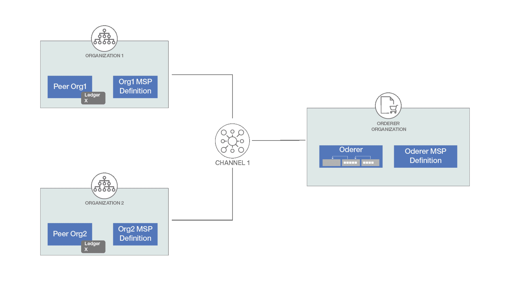
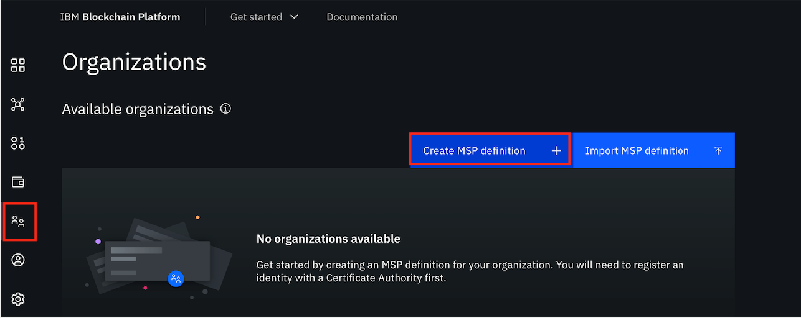
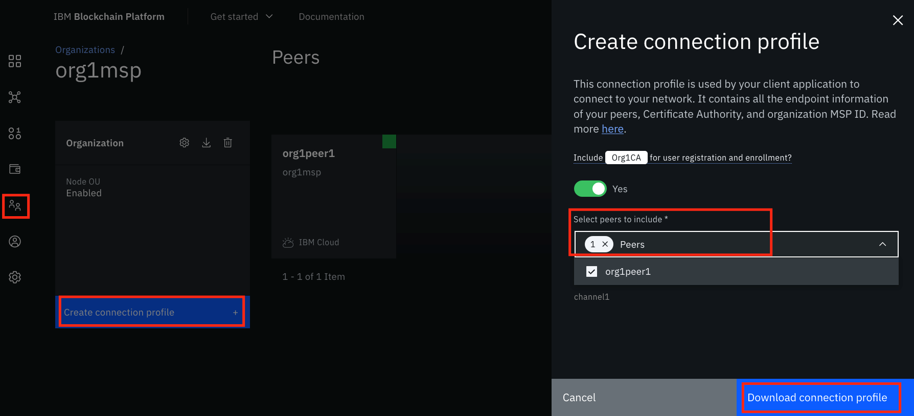

# IBM Blockchain Platform on Cloud
> 在 IBM Cloud 上部署 Fabric 区块链网络。(生产环境 - 要给钱的环境，很多钱的那种)

IBM Blockchain Platform 是一种“区块链即服务”产品，可为用户提供部署灵活性、可伸缩性以及对网络组件的可控性。此平台使用 Hyperledger Fabric 1.4.x 代码库，并将组件部署到由用户管理和控制的 IBM Cloud Kubernetes Service 中。用户界面可简化并加快区块链网络组件的部署过程。本教程将引导您完成使用 IBM Blockchain Platform 设置基本区块链网络的步骤。

## 前提条件:
- 区块链基础知识：Hyperledger Fabric：您应了解区块链网络及其组件。
- 一个 IBM Cloud 帐户：有很多钱的账户。
- VS Code V1.38 或更高版本。
- 适用于 VS Code 的 IBM Blockchain Platform 扩展。

## IBM 官方推荐配置:
- Kubernetes
```
Service Name        - for IBM Blockchain Platform
Plan                - Standard
Quantity            - 1
Credit per Month    - 391.84 USD
Unit                - Worker node-hour
Remark: 
Worker node
$0.52 / hr
b3c.8x32 - 8 vCPUs 32GB RAM
IP Allocation
US$16.00 / month
```

- Storage
```
Service Name        - File Storage
Plan                - ibmc-file-silver
Quantity            - 560
Credit per Month    - 112.00 USD
Unit                - IOPS/GB
Remark              - 4 IOPS/GB
```

- Blockchain
```
Service Name        - IBM Blockchain Platform
Plan                - Standard
Quantity            - 2.85
Credit per Month    - 624.83 USD
Unit                - vCPU/hour
```

- DevOps

```
Cloud Monitoring with Sysdig - Graduated Tier 
Remark: 105.00 USD 
Log Analytic with LogDNA - 7 day Log Search
Remark: 
5GB log per month
7.50 USD per month
Cloud Activity Tracker with LogDNA - 7 day Log Search
Remark: 
5GB log per month
7.50 USD per month
Cloud HSM - Cloud HSM 7.0
```


-  Total: **1,249.35** USD per month

## 整体流程:
> 设计任何区块链解决方案的第一步都是确定区块链共同体（即，区块链网络的参与者）。在选择区块链网络的组件（例如，组织数、每个组织的同级数、排序者和认证中心 (CA)）后，就可以开始在云上设置该网络了。如果区块链网络的结构类似于下图，则您需要创建以下项（如该结构所示）：

- 3 个 CA
- 3 个成员资格服务提供者 (MSP)
- 2 个Peers
- 1 个排序者
- 1 个通道（包含 2 个同级组织和 1 个排序者组织）



### 1. 创建 IBM Cloud Kubernetes Service
> 选择适当的套餐、Kubernetes 版本和风格等之后，在 IBM Cloud 上创建 IBM Cloud Kubernetes Service (IKS)。确保 Kubernetes 服务集群已完全部署。**具体配置参考推荐配置**。

### 2. 在 IBM Cloud 上创建 IBM Blockchain Platform 服务实例
> 在 IBM Cloud 目录上搜索 IBM Blockchain Platform 服务，然后单击该服务。选择地区，提供服务名称和资源组，然后单击 Create。


> 在本教程中，我们已设置 Kubernetes 集群，因此请选择选项 Link a Kubernetes cluster on IBM Cloud，然后单击 Let’s get setup!。提供现有集群的名称，然后单击 Next。（如果尚未创建 Kubernetes 集群，那么可选择 Create a Kubernetes cluster on IBM Cloud。）


### 3. 启动该平台
> 在将 IBM Blockchain Platform 成功部署到集群之后，可以启动 IBM Blockchain Platform。


> 单击 Launch the IBM Blockchain Platform console。在 IBM Blockchain Platform 页面上，单击 Let’s get started。突出显示的信息图标提供了有关该节点/步骤的更多详细信息。此类信息可在您部署区块链平台时帮助您完成每个步骤。


### 4. 添加认证中心 - CA
> 作为区块链的切入点，您需要创建一个 MSP 组织。为此，您需要具有组织管理员用户身份。除了定义组织外，CA 还会创建属于该组织的所有身份和证书。因此，设置区块链网络的第一步是创建 CA。

- 开始使用 CA 设置您的网络。单击 Add Certificate Authority，选择 Create a Certificate Authority 部分，然后单击 Next。


- 为该 CA 提供一个名称（例如“Org1CA”）、CA 管理员注册 ID 和注册密钥（例如，ID“admin”和密钥“adminpw”），然后单击 Next。

- 当您看到摘要时，单击 Add Certificate Authority。

### 5. 注册用户
> 使用在上一步中创建的 CA 来注册用户。
- 单击您创建的 CA，如下所示：


- 单击 Associate identity。这会将 CA 管理员身份与 CA 节点相关联。提供 CA 注册 ID 和注册密钥（与步骤 4 中使用的注册 ID 和注册密钥相同）。您可以更改身份显示名称或继续使用所提供的默认名称。单击 Associate identity。

- 单击 Register user，然后为组织注册管理员。

提供注册 ID 和注册密钥（例如，ID“org1admin”和密钥“org1adminpw”）。将此身份的类型设置为 admin。此身份将充当组织管理员，允许您使用控制台来操作节点。余下的属性 Maximum enrollments 是一个可选属性。请将其留空，然后单击 Next。


- 接下来，将要求您添加一些属性。这可用于对资源进行基于角色的访问控制。就本教程而言，您不需要使用属性。单击 Register user。


- 重复步骤 1 – 4，以使用 peer 类型身份再注册一个用户。该身份允许您部署一个同级。

### 6. 创建组织的 MSP 定义
> 同级组织的正式定义称为 MSP。您已经创建了组织 CA 和用户，因此现在可以创建 MSP 定义了。

- 导航到左侧面板中的 Organizations 选项卡，然后单击 Create MSP definition，如下所示：


- 提供所有必需的信息： 

```
- MSP details：MSP display name 和 MSP ID。

- Root Certificate Authority details。选择 Root Certificate Authority（您在步骤 4 中创建的组织的根 CA），然后提供一个身份名称。

- Admin certificates：选择您为组织创建的注册 ID 作为管理员身份（例如，org1admin）。提供注册密钥和身份名称。
```

- 单击 Generate。这会以组织管理员身份生成该身份，并将该身份添加到电子钱包中。


- 为避免丢失这些公钥和私钥，请立即将其导出，然后单击 Next。最后，单击 Create MSP definition。

### 7. 创建同级节点 (Peer)
> 同级是网络的一个基本要素，用于托管账本和智能合约。

- 导航到 Nodes 选项卡，单击 Add peer，选择 Create a peer，然后单击 Next。


- 提供同级显示名称，将高级部署选项保留为默认值，然后单击 Next。

- 在下一个屏幕上，选择您在步骤 4 中创建的 CA。选择在步骤 5 结束时为同级创建的同级身份的注册 ID，并提供相关的密钥。然后，从下拉列表中选择 Organization MSP 和 Fabric 版本，然后单击 Next。


- 在下一个屏幕上，将要求您关联一个身份，以使其成为同级的管理员。就本教程而言，您可以选择组织管理员 (org1 msp admin)，然后单击 Next。

- 复查摘要，然后单击 Add Peer。要在同一组织中添加更多同级，请按照步骤 5 中所述使用同级身份注册一个新用户，然后重复此步骤。

**注意：** 重复步骤 4 – 7，以根据需要创建更多的组织和同级。

### 8. 创建排序者
> 排序者节点将运行通信服务，以保证网络中的事务传送。

- 要创建排序者，您需要先创建排序者 CA。执行您在步骤 4 中所执行的相同步骤来创建排序者 CA。
- 接下来，使用排序者 CA 来注册排序者用户身份。再次执行步骤 5 中的所有操作，以使用管理员和排序者身份来注册用户。
- 以步骤 6 中所采用的方式创建排序者 MSP 定义。确保您选择了根认证中心的排序者 CA。
- 现在可以开始创建排序者节点了。导航到 Nodes 选项卡，并单击 Add ordering service

选择 Create an ordering service，然后单击 Next。提供 Ordering service display name，并可以将 Number of ordering nodes 指定为一个排序节点。（一个排序节点适用于开发和测试。）然后单击 Next。


- 按照步骤 7 中所述提供所需信息，但请确保您选择了正确的排序者 CA 和排序者 MSP。单击 Next。
- 关联排序者管理员身份，然后单击 Next。
- 复查摘要，然后单击 Add ordering service。

### 9. 在排序者上添加组织作为共同体成员
- 导航到 Nodes 选项卡，并单击您在步骤 8 中创建的排序者。
- 在 Consortium members 下，单击 Add organization。
- 选择 Existing MSP Id，然后从下拉列表中选择您在步骤 6 中创建的组织 MSP（MSP 表示同级的组织），然后单击 Add organization。
- 针对将要成为该共同体一部分的所有组织重复此步骤。

### 10. 创建通道
> 通道是区块链网络中的一组组件进行通信和交易时使用的一种机制。
- 导航到左侧导航栏中的 Channels 选项卡，然后单击 Create channel。单击 Next。

- 在 Channel details 中，为通道提供一个名称。从“Ordering Service”下拉列表中选择您创建的排序者。单击 Next。

- 现在将组织添加到通道中。选择组织（组织的 MSP）作为要构成通道的通道成员（一次选择一个），然后单击 Add。为组织选择适当的权限（操作者/编写者/阅读者）。重复此步骤，以将所有必要的组织都添加到通道中。单击 Next。


- 从可用选项中选择适当的通道更新策略，然后单击 Next。

- 接下来是通道创建者组织。选择 Channel Creator MSP，并从下拉列表中指出要创建通道的组织。然后，为该组织关联可用的管理员身份，并单击 Next。

- 完成上述所有步骤后，复查通道信息，然后单击 Create channel。

### 11. 加入通道
- 导航到左侧导航栏中的 Channels 选项卡，然后单击 Join Channel。
- 选择您的排序者，然后单击 Next。
- 提供您在步骤 10 中创建的通道的名称，然后单击 Next。
- 选择要加入通道的同级，然后单击 Join Channel。

### 12. 下载连接配置文件
在成功创建网络并在网络上实例化智能合约后，就可以开始编写能使用任何 Fabric SDK (Node.js/Java) 与区块链网络进行交互的客户端应用程序。SDK 将使用连接配置文件连接到网络。要构建和下载连接配置文件，请导航到 Organizations 选项卡，单击组织 MSP Link，然后单击 Create connection profile。选择要包含的同级，然后进行下载。


## 结束语
> 本教程展示了使用 IBM Blockchain Platform 控制台创建区块链网络、在网络上部署智能合约以及下载网络连接配置文件的步骤。IBM Blockchain Platform 是一个高度可定制的平台，通过此平台，您甚至可以在网络中测试、调试和升级已实例化的智能合约。下一步，您可以编写客户端应用程序，以调用智能合约在区块链账本上创建、传输或更新资产。 关于Smart Contract这块我会独立讲解。

**最后说明一下：** 根据集群中资源的可用情况，可以在网络中添加组件。如果您需要添加更多组件（例如同级或组织），那么可能需要相应地扩展 Kubernetes 集群的大小。

## Reference:
- [逐步了解如何设置基本区块链网络 2020-09-30](https://developer.ibm.com/zh/tutorials/quick-start-guide-for-ibm-blockchain-platform/)
- [Learn step-by-step how to set up a basic blockchain network 2020-07-10](https://developer.ibm.com/tutorials/quick-start-guide-for-ibm-blockchain-platform/)
- [IBM Blockchain Platform on Cloud 2019-10-09](https://developer.ibm.com/zh/depmodels/cloud/articles/cl-lo-ibm-blockchain-platform-on-cloud/)