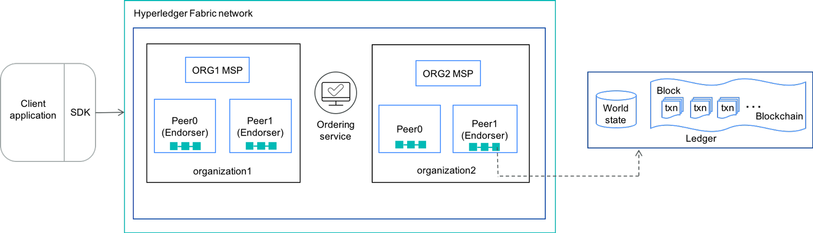

# 区块链基础知识：Hyperledger Fabric
> 了解如何充分利用这个多功能的区块链框架

区块链技术为创新提供了丰富的机会。它具有通过从根本上改变业务交易方式来革新业务的能力。

那么，开发人员开始为区块链网络开发代码的最佳方法是什么？我建议首先牢牢掌握Hyperledger Fabric项目。  

Hyperledger是一种开源协作成果，旨在促进跨行业的区块链技术供企业使用。该全球合作由The Linux Foundation主持。  

Hyperledger孵化并支持一系列区块链业务技术，框架，库和应用程序。该Hyperledger项目承载几个blockchain框架，包括Hyperledger Fabric。 

本文概述了什么是Hyperledger Fabric，如何使用它来构建解决方案以及如何在Hyperledger Fabric中执行事务。

## 1. 什么是Hyperledger Fabric？
> Hyperledger Fabric是用于私有和许可业务网络的开源框架实现，其中成员身份和角色对于其他成员是已知的。它被设计为开发具有模块化体系结构的解决方案的基础。它允许分类账数据库，共识机制和成员资格服务等组件即插即用。它利用容器技术并提供企业就绪的网络安全性，可伸缩性和机密性。

### Hyperledger Fabric网络具有以下组件：
- **资产 (Assets)**: 资产是任何有价值的东西。资产具有状态和所有权。资产在Hyperledger Fabric中表示为键值对的集合。
- **共享账本 (Shared ledger)**: 分类帐记录资产的状态和所有权。分类帐包括两个部分：
    - 在 **世界的状态(World State)** 描述在给定时间点的台账的状态。这是分类帐的数据库。
    - 该 **blockchain** 是记录所有交易事务日志记录。
- **智能合约 (Smart contract)**: Hyperledger Fabric智能合约称为chaincode。Chaincode是定义资产和相关交易的软件；换句话说，它包含系统的业务逻辑。当应用程序需要与分类帐交互时，将调用Chaincode。链码可以用Golang或Node.js编写。
- **对等节点 (Peer Nodes)**: 对等是网络的基本元素，因为它们托管分类帐和智能合约。对等方执行链码，访问分类帐数据，认可交易并与应用程序接口。一些同行可以是背书同行，也可以是背书。每个链码都可以指定背书策略，该政策定义了有效交易背书的必要条件和充分条件。
- **通道 (Channel)**: 通道是由对等体集合形成的逻辑结构。此功能允许一组对等方创建单独的交易分类帐。
- **组织 (Organizations)**: yperledger Fabric网络是由网络中不同组织拥有和贡献的对等体构建的。该网络之所以存在是因为组织将其个人资源贡献给了集体网络。对等点具有成员资格服务提供商从其所属组织分配的身份（数字证书）。不同组织的同级可以在同一频道上。
- **会员服务提供商（MSP - Membership Services Provider）**: MSP被实现为证书颁发机构，以管理用于认证成员身份和角色的证书。在Hyperledger Fabric网络中没有未知身份可以进行交易。它管理用户ID并验证网络上的所有参与者，从而使Hyperledger Fabric成为私有和许可网络。
- **排序服务 (Ordering service.)**: 排序服务将交易打包成块，以交付给通道上的对等方。它保证了网络中的交易交付。它与对等方和认可对等方进行通信。排序服务支持的配置机制是Solo和Kafka。

**Fig1. Hyperledger Fabric网络的组件（为简单起见，未显示通道）**

## 2. 区块链解决方案如何运作
> 在区块链解决方案中，Hyperledger Fabric网络充当后端，而应用程序前端则与网络进行通信。SDK可帮助您在前端和后端之间建立通信，例如Node.js SDK和Java SDK。SDK提供了一种执行用户链码，在网络中执行事务，监视事件等的方法。

要编写区块链应用程序，您需要：
- 用Go等受支持的编程语言编写chaincode。
- 在Hyperledger Fabric网络上部署链码。
- 使用SDK开发客户端应用程序。

## 3. 区块链交易如何执行
Hyperledger Fabric网络中事务的高级请求流如下所示：
- 客户端使用Node.js或Java™SDK连接到Hyperledger Fabric网络。客户端使用SDK API，创建一个事务并将其发送给背书对等方。
- 背书对等方将验证客户的签名，模拟交易并发送背书签名。
- 如果交易得到认可，则客户将交易提交给订购服务。否则，交易被取消。
- 订购服务将交易传递给对等方。所有对等方都提交并应用相同的事务序列，并更新其状态。

## 4. 概要
Hyperledger Fabric是一个区块链框架实现。IBM Cloud上的IBM Blockchain解决方案和Blockchain Platform即服务都利用Hyperledger Fabric。 

## Reference:
- [深入了解Hyperledger Fabric架构](https://hyperledger-fabric.readthedocs.io/en/release-1.4/arch-deep-dive.html)
- [什么是超级账本？](https://blockgeeks.com/guides/what-is-hyperledger/)
- [Basic Introduction of Hyperledger Fabric](https://developer.ibm.com/articles/blockchain-basics-hyperledger-fabric/)