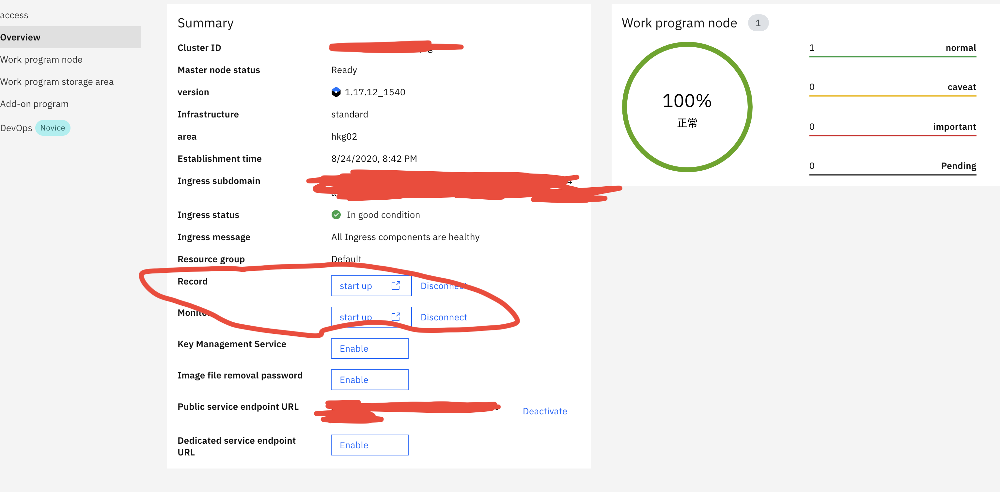

# IBM Blockchain Platform 运维系列 （DevOps)

## Topic 1.管理已经部署的模块 - CAs, Peers, and ordering nodes

### A. Peers 如何扩容
> 在成功构建区块链网络之后，随着区块链交易数据的增加，如何给peer以及ordering nodes的资源重制就成了一个必不可少的操作。所以本文主要还是关注在如何监控已经部署的资源以及是否能够对peer 和 ordering node做弹性扩容。

- 直接对不同节点的File Storage做扩容，具体可参考：https://cloud.ibm.com/docs/FileStorage?topic=FileStorage-expandCapacity&locale=en
- 没错就是这么直接和暴力，然后更新之后在IBM Blockchain Platform里面发现Peers的Storage没变化。
- 没错就是bug，直接找IBM support team 问原因。他们直接让我去 k8s里面查该peer的storage size, 是正常的。
```
Can you please inspect a peer pod container and perform this command?

$ kubectl exec -c peer -n n4269ca -- df -h

It should list an entry like this...

XXXXXXXXXXXXXX:/DSW02SEV2117092_7/data01/data 101G 0 101G 0% /data
```
- 总结下：要对节点扩容，直接Expand File Share Capacity 即可。然后不放心的话就去k8s里面通过kubectl查看先即可。

### B. Cloud Monitoring with Sysdig & Log Analytic with LogDNA
> 这两个没什么可以讲的,但是记住不要自己尝试去这两个服务下面新建service然后连接到IBP的K8s, 这样一般是不行的。
- 正确的方法比较十分方便，就是直接去k8s 的 Cluster，然后点击Overview 的Log和Monitor 即可。




### Reference:
- [Expanding File Share Capacity](https://cloud.ibm.com/docs/FileStorage?topic=FileStorage-expandCapacity&locale=en)
- [IBM Cloud Monitoring with Sysdig](https://cloud.ibm.com/docs/Monitoring-with-Sysdig?topic=Monitoring-with-Sysdig-getting-started)
- [Advanced deployment options](https://cloud.ibm.com/docs/blockchain-sw-25?topic=blockchain-sw-25-ibp-console-adv-deployment#ibp-console-adv-deployment-peers-sizing-creation)