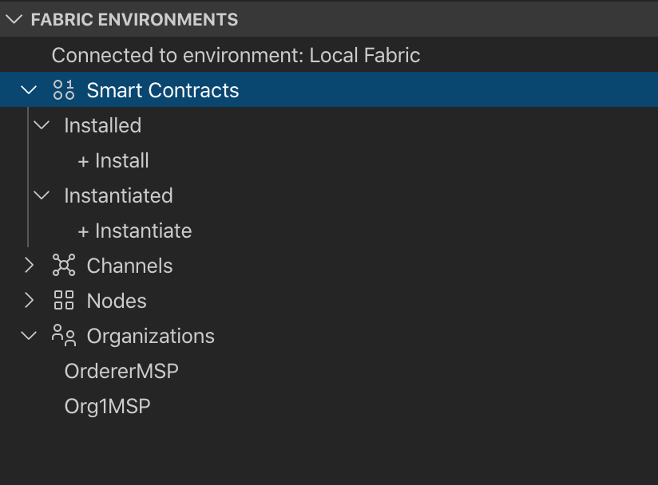

# 用 Visual Studio Code 开发 Smart Contract
> IBM Blockchain Platform 还提供了 VS Code extension，可以在 VS Code 里方便的开发 Smart Contract，并可以与区块链网络交互，完成一些测试、部署、管理工作。

本文这部分内容将直接用 Extension 提供的示例代码，建立一个 Smart Contract 打包文件，并部署到 mychannel 上。

看完本文后，您将了解如何将IBM Blockchain Platform Extension for VSCode用于：
- 创建智能合约
- 打包智能合约
- 安装并实例化智能合约包
- 测试智能合约
- 部署智能合约到IBM Blockchain Platform


## 架构流程


1. 设置并启动VSCode平台
2. 使用Node.js开发智能合约
3. 在VS Code平台中启动Fabric网络的本地实例
4. 安装并实例化智能合约
5. 测试智能合约交易

### 1. 设置并启动VSCode平台
> 请参考 https://code.visualstudio.com

进入 VS Code 界面，在 Extensions 界面中搜索并安装 IBM Blockchain Platform。

安装成功后，在左侧菜单中会发现多了 IBM Blockchain Platform 按钮；点击进入 Blockchain Platform Extension 界面。


### 2. 使用Node.js开发智能合约
> 展开第一个项目 Smart Contract；并将鼠标停放，点击 “…” 在弹出菜单中选择 Create New Project；选择 JavaScript；输入 Project name：ibpsimplemsg；选择 Project 目录，接下来 VS Code 会自动建立一个示例项目的所有文件。（这需要一些时间，请耐心等待。）


> 将鼠标停放在 Smart Contract 上，点击菜单 Package Open Project，这会将当前 Smart Contract 项目自动打包，并保存于当前用户.fabric-vscode/packages 目录下，文件名类似于 ibpsimplemsg@0.0.1.cds。这个文件是可以用解压缩文件打开的。

### 3. 在VS Code平台中启动Fabric网络的本地实例
> 现在，您可以部署到本地结构网络了。您必须先连接到网络，然后才能在网络上安装智能合约。VSCode扩展随附的网络非常适合开发-它提供了最少的资源来开发和测试合同。以下Docker容器是在本地计算机上启动的，每个容器在网络中具有不同的角色：Orderer, Certificate Authority, CouchDB, and Peer。

- 单击扩展名，您应该在编辑器的左侧看到FABRIC ENVIRONMENTS。在此部分下，您应该看到本地结构。单击它以启动本地结构。


- 您的扩展现在将置备那些将充当网络中节点的Docker容器。设置完成且网络启动并运行后，您将在VSCode中看到以下内容：


### 4. 安装并实例化智能合约
> 现在，Fabric网络正在运行，我们需要将智能合约安装到对等方。

**安装**

- 在FABRIC ENVIRONMENTS靠近底部，点击Smart Contracts> Installed> Install您将看到类似于下图的弹出窗口。

- 然后选择打包的合同：auction@0.0.1 Packaged 注意0.0.1来自您的package.json行： "version": "0.0.1"  

安装完成后，您将收到一条消息Successfully installed on peer peer0.org1.example.com。您还应该看到合同列Installed在下FABRIC ENVIRONMENTS。

**实例化**
- 在Smart Contracts下，您将看到 Instantiated 部分。+ Instantiate在它下面单击。
- 然后，扩展程序将询问您要实例化的合同和版本-选择auction@0.0.1 Installed。
- 然后，扩展程序将询问您要实例化的函数—输入 instantiate
- 接下来，它将询问您该函数的参数。没有，因此只需按Enter。
- 接下来，扩展程序将询问您是否要使用提供私有数据收集配置文件？-点击no。

最后，扩展程序会询问您是否要选择智能合约签注策略。选择Default (single endorser, any org)。

一旦你完成合同的实例，你应该得到的消息Successfully instantiated smart contract，你应该看到auction@0.0.1下Instantiated下FABRIC ENVIRONMENTS。 

### 5. 测试智能合约交易
您可以直接在VSCode平台上测试事务。在该Fabric Gateways部分下，单击Local Fabric，然后单击mychannel，然后单击auction@0.0.1 -展开以显示以下内容：


请注意，auction.js列出了您在文件中创建的所有事务。如果右键单击该CreateAssetsandMembers事务，然后选择Submit Transaction，将弹出一个弹出窗口。按回车键（不要输入任何参数）。再次按回车键（交易没有临时数据），您应该得到一个响应，说明交易已成功提交。

此时，您将创建2个商品实例和2个交易者实例。

现在让我们提交checkQuantity交易。和以前一样，右键单击checkQuantity事务并选择Submit Transaction。这次您必须输入一个参数。输入["GOLD"]作为参数。点击返回。再次点击回车键（交易没有瞬时数据）。您应该在输出窗口中看到以下响应：


现在让我们提交trade交易。提供["GOLD", "RT2"]作为参数列表。点击返回。再次点击回车键（交易没有瞬时数据）。您应该在输出窗口中看到以下响应：


## 部署智能合约到IBM Blockchain Platform

### 1. 准备好上一步骤中打包好的文件 ibpsimplemsg@0.0.1.cds。
> 如果没有进行上一步操作，可以直接使用这个文件： https://github.com/tomxucnxa/ibp_project_1/blob/master/cds/ibpsimplemsg%400.0.1.cds

### 2. 点击左侧菜单中的 Smart Contract；再点击 Install smart contract，选择准备好的 cds 文件，并在下一步中选中 Peer1 Org1 和 Peer1 Org2；再点击 Install smart contract 按钮。


### 3. 安装成功后，在 Installed smart contracts 列表中，可以发现刚安装成功的 Smart contract；在其右侧弹出菜单中，点击 Instantiate。
```
Channel：mychannel
Members: msporg1, msporg2
Policy: 1 out of 2
Approve peer: Peer1 Org1 （也可以是 Peer1 Org2）
```
其余内容默认即可。最终点击 Instantiate smart contract 按钮完成 Instantiate 过程，这个过程需要一些时间，请耐心等待。


## Reference:
- [创建并执行区块链智能合约](https://developer.ibm.com/zh/patterns/create-and-execute-a-blockchain-smart-contract-ibp-v20/)
- [Github SmartContractTrading](https://github.com/IBM/SmartContractTrading-wFabric1-4-VSCodeExt/blob/master/README.md)