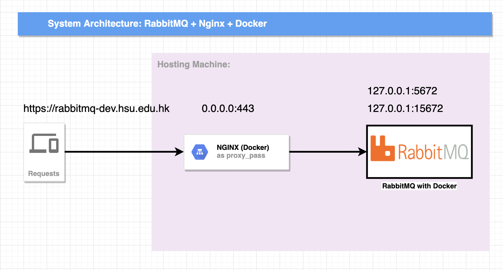

# Install RabbitMQ with Docker

> This document is mainly introduce install RabbitMQ with Docker for production usage;


#### System Overview of RabbitMQ Environment

> 1. Using NGINX as proxy server to router rabbitmq so that no need to config https / ssl for rabbitmq; 
> 2. Update certs only on NGINX side and no need to config on rabbitmq side, easy to manage these services;




#### 1. Install Docker on Ubuntu:

> 一键安装，十分推荐:

```
curl -fsSL https://get.docker.com | bash -s docker --mirror Aliyun
```

#### 2. Hosting Machine:

> 1. We need to prepare nginx
> 2. Prepare SSL Certs and Data Folder;

##### 2.1 Deploy NGINX with HTTPS with docker:

> Install nginx with docker;

```
docker run --detach \
--name mq-nginx \
-e TZ=Asia/Shanghai \
-p 443:443 \
-v /home/qzheng/nginx/data:/usr/share/nginx/html:rw \
-v /home/qzheng/nginx/config/nginx.conf:/etc/nginx/nginx.conf:rw \
-v /home/qzheng/nginx/logs:/var/log/nginx/:rw \
-v /home/qzheng/nginx/ssl:/ssl/:rw \
--net=host \
-d nginx
```

> create nginx.conf file

```
#运行nginx的用户
user  nginx;
#启动进程设置成和CPU数量相等
worker_processes  1;

#全局错误日志及PID文件的位置
error_log  /var/log/nginx/error.log warn;
pid        /var/run/nginx.pid;

#工作模式及连接数上限
events {
        #单个后台work进程最大并发数设置为1024
    worker_connections  1024;
}

http {
        #设定mime类型
    include       /etc/nginx/mime.types;
    default_type  application/octet-stream;

        #设定日志格式
    log_format  main  '$remote_addr - $remote_user [$time_local] "$request" '
                      '$status $body_bytes_sent "$http_referer" '
                      '"$http_user_agent" "$http_x_forwarded_for"';

    access_log  /var/log/nginx/access.log  main;

    sendfile        on;
    #tcp_nopush     on;

        #设置连接超时的事件
    keepalive_timeout  65;

        #开启GZIP压缩
    #gzip  on;

    include /etc/nginx/conf.d/*.conf;
}
```

> create conf.d/default.conf file

```
server {
    # listen    80;       														#侦听80端口，如果强制所有的访问都必须是HTTPs的，这行需要注销掉
    listen    443 ssl;
    server_name  rabbitmq-dev.hsu.edu.hk;             #域名

    # charset koi8-r;
    # access_log  /var/log/nginx/host.access.log  main;

    # 增加ssl
    # ssl on;        #如果强制HTTPs访问，这行要打开
    ssl_certificate      /ssl/STAR_hsu_edu_hk.crt;
    ssl_certificate_key  /ssl/hsu.edu.hk.key;

    ssl_session_cache    shared:SSL:1m;
    ssl_session_timeout  5m;

    # 指定密码为openssl支持的格式
    ssl_protocols  SSLv2 SSLv3 TLSv1.2;

    ssl_ciphers  HIGH:!aNULL:!MD5;  									# 密码加密方式
    ssl_prefer_server_ciphers  on;   									# 依赖SSLv3和TLSv1协议的服务器密码将优先于客户端密码

    # 定义首页索引目录和名称
    location / {
        root   /usr/share/nginx/html;
        index  index.html index.htm;
    }

    #定义错误提示页面
    # error_page  404              /404.html;

    # 重定向错误页面到 /50x.html
    error_page   500 502 503 504  /50x.html;
    location = /50x.html {
        root   /usr/share/nginx/html;
    }
}
```


#### 3. Install RabbitMQ:

```
docker run --detach \
--hostname rabbitmq \
--name rabbitmq \
-e TZ=Asia/Shanghai \
-p 5672:5672 \
-p 15672:15672 \
-v /home/qzheng/rabbitmq:/var/lib/rabbitmq \
-e RABBITMQ_DEFAULT_USER=rabbitmq-dev \
-e RABBITMQ_DEFAULT_PASS=password-rabbitmq-dev \
-d rabbitmq:3-management-alpine
```


```
location /rabbitmq/api/ {
    rewrite ^ $request_uri;
    rewrite ^/rabbitmq/api/(.*) /api/$1 break;
    return 400;
    proxy_pass http://127.0.0.1:15672$uri;
    proxy_buffering                    off;
    proxy_set_header Host              $http_host;
    proxy_set_header X-Real-IP         $remote_addr;
    proxy_set_header X-Forwarded-For   $proxy_add_x_forwarded_for;
    proxy_set_header X-Forwarded-Proto $scheme;
}

location /rabbitmq/ {
    port_in_redirect on;
    proxy_redirect off;
    proxy_pass http://127.0.0.1:15672/;
    proxy_set_header X-Real-IP $remote_addr;
    proxy_set_header User-Agent $http_user_agent;
    proxy_set_header Host $http_host;
    proxy_set_header X-Forwarded-For $proxy_add_x_forwarded_for;
    proxy_set_header X-Forwarded-Proto $scheme;
    rewrite ^/rabbitmq/(.*)$ /$1 break;
}
```


#### Reference:

- https://juejin.cn/post/6844904199608614920
- https://registry.hub.docker.com/_/rabbitmq/
- https://www.youtube.com/watch?v=Gtq9nBr1Ca0
- https://github.com/ekim197711/rabbitmq-nginx
- https://www.jianshu.com/p/5f9bd492f186  (docker安装nginx并配置通过https访问)
- https://stackoverflow.com/questions/49742269/rabbitmq-management-over-https-and-nginx
- https://www.cnblogs.com/ybyn/p/13959135.html （直接MQ配置https 和 amqp/ssl）

- https://www.oren.net.cn/post-9910273779569621.html  (记一次nginx location proxy_pass 反向代理失效的问题)
- https://gist.github.com/lukebakken/a6bae4759979b37ad2e87d48b47aa02e  ( lukebakken/nginx.conf  - RabbitMQ / NGINX)
- https://dev.to/davedodea/bytesize-rabbitmq-management-ui-and-nginx-4ob9 （[ByteSize] RabbitMQ management UI and Nginx）
